# Build and Rebuild Lifecycle Reference

> **Purpose**: This document provides a detailed reference for the build and rebuild lifecycle of the Odoo Language Server symbol database. It covers server startup, LSP initialization, the build pipeline, dependency management, and rebuild mechanisms.  
> **Audience**: Developers maintaining or extending the odoo-ls codebase.  
> **Prerequisites**: Familiarity with Rust, the LSP protocol, and the [Python Core Onboarding Guide](python-core-onboarding.md).

## Table of Contents

1. [Overview](#1-overview)
2. [Server Startup and LSP Initialization](#2-server-startup-and-lsp-initialization)
3. [Initial Database Build](#3-initial-database-build)
4. [Build Pipeline Phases](#4-build-pipeline-phases)
5. [Dependency System](#5-dependency-system)
6. [Partial Rebuilds](#6-partial-rebuilds)
7. [Interrupt and Debounce Mechanisms](#7-interrupt-and-debounce-mechanisms)
8. [Complete Lifecycle Diagram](#8-complete-lifecycle-diagram)

---

## 1. Overview

The Odoo Language Server maintains a **symbol database** that represents all code entities (files, classes, functions, variables) and their relationships. This database is built incrementally through a three-phase pipeline and is rebuilt partially when files change.

### Key Concepts

| Concept | Description |
|---------|-------------|
| **Symbol Tree** | Hierarchical structure: Root → Package → File → Class/Function/Variable |
| **Build Phase** | One of three sequential steps: ARCH → ARCH_EVAL → VALIDATION |
| **Build Status** | State of a symbol: PENDING, IN_PROGRESS, DONE, INVALID |
| **Dependency** | A relationship where one symbol's build requires another's to be complete |
| **Rebuild Queue** | Collection of symbols waiting to be processed for a specific phase |

### Build Status State Machine

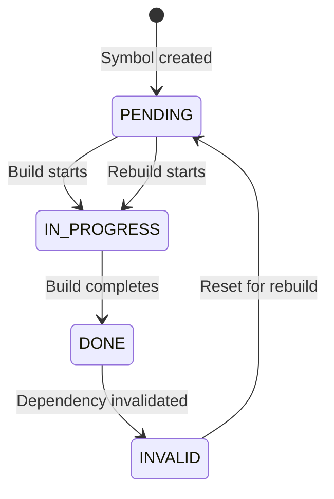
```mermaid
stateDiagram-v2
    [*] --> PENDING: Symbol created
    PENDING --> IN_PROGRESS: Build starts
    IN_PROGRESS --> DONE: Build completes
    DONE --> INVALID: Dependency invalidated
    INVALID --> PENDING: Reset for rebuild
    PENDING --> IN_PROGRESS: Rebuild starts
```

---

## 2. Server Startup and LSP Initialization

### Entry Point

The server starts in `main.rs` with two possible modes:
- **Stdio mode** (default): Communication via stdin/stdout
- **TCP mode** (debug): Communication via TCP socket

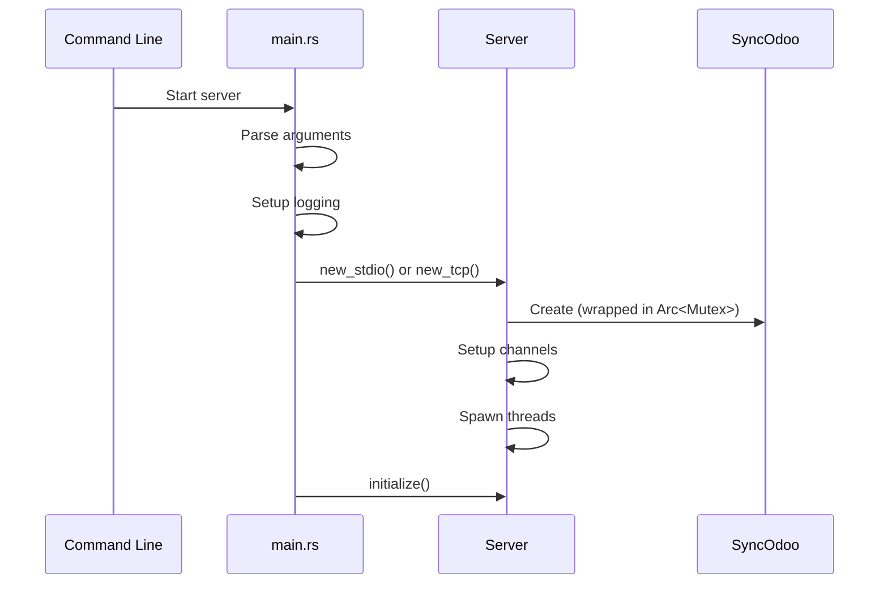
```mermaid
sequenceDiagram
    participant CLI as Command Line
    participant Main as main.rs
    participant Server as Server
    participant SyncOdoo as SyncOdoo
    
    CLI->>Main: Start server
    Main->>Main: Parse arguments
    Main->>Main: Setup logging
    Main->>Server: new_stdio() or new_tcp()
    Server->>SyncOdoo: Create (wrapped in Arc<Mutex>)
    Server->>Server: Setup channels
    Server->>Server: Spawn threads
    Main->>Server: initialize()
```

### Thread Architecture

The server spawns two main threads:

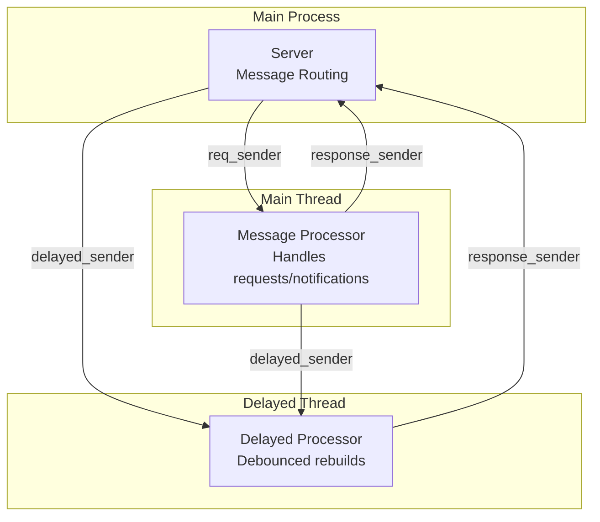
```mermaid
graph TD
    subgraph "Main Process"
        Server[Server<br/>Message Routing]
    end
    
    subgraph "Main Thread"
        MainLoop[Message Processor<br/>Handles requests/notifications]
    end
    
    subgraph "Delayed Thread"
        DelayedLoop[Delayed Processor<br/>Debounced rebuilds]
    end
    
    Server -->|req_sender| MainLoop
    Server -->|delayed_sender| DelayedLoop
    MainLoop -->|delayed_sender| DelayedLoop
    MainLoop -->|response_sender| Server
    DelayedLoop -->|response_sender| Server
```

### Channel Architecture

| Channel | Direction | Purpose |
|---------|-----------|---------|
| `req_sender` / `req_receiver` | Server → Main Thread | Dispatch requests and notifications |
| `response_sender` / `response_receiver` | Threads → Server | Send responses and notifications to client |
| `delayed_sender` / `delayed_receiver` | Main Thread → Delayed Thread | Signal rebuilds and configuration changes |

### LSP Handshake

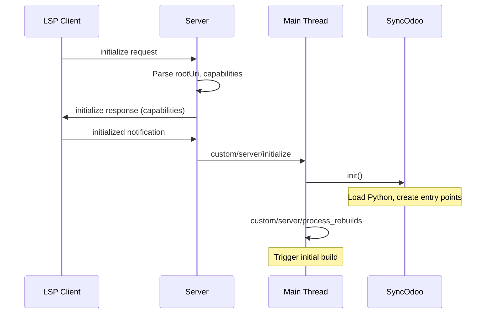
```mermaid
sequenceDiagram
    participant Client as LSP Client
    participant Server as Server
    participant Main as Main Thread
    participant Odoo as SyncOdoo
    
    Client->>Server: initialize request
    Server->>Server: Parse rootUri, capabilities
    Server->>Client: initialize response (capabilities)
    Client->>Server: initialized notification
    Server->>Main: custom/server/initialize
    Main->>Odoo: init()
    Note over Odoo: Load Python, create entry points
    Main->>Main: custom/server/process_rebuilds
    Note over Main: Trigger initial build
```

### Server Capabilities Advertised

The server tells the client what features it supports:

```rust
ServerCapabilities {
    text_document_sync: Full,           // Full document sync on changes
    hover_provider: true,               // Hover information
    completion_provider: true,          // Autocompletion
    definition_provider: true,          // Go to definition
    references_provider: true,          // Find references
    document_symbol_provider: true,     // Document outline
    workspace_symbol_provider: true,    // Workspace symbol search
    // ...
}
```

---

## 3. Initial Database Build

After LSP initialization, the server builds the complete symbol database.

### Initialization Sequence

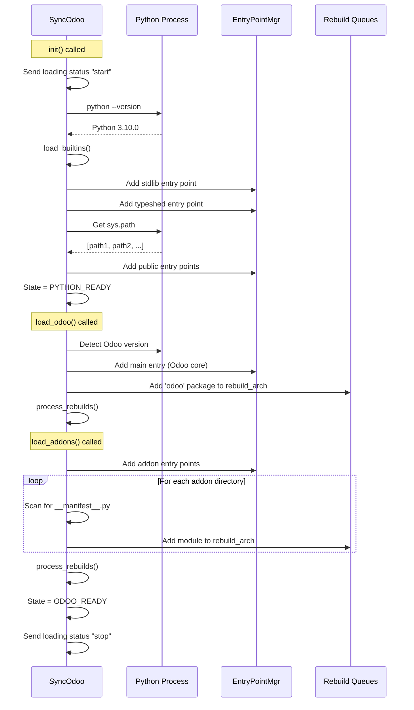
```mermaid
sequenceDiagram
    participant Odoo as SyncOdoo
    participant Python as Python Process
    participant EntryMgr as EntryPointMgr
    participant Queue as Rebuild Queues
    
    Note over Odoo: init() called
    Odoo->>Odoo: Send loading status "start"
    Odoo->>Python: python --version
    Python-->>Odoo: Python 3.10.0
    Odoo->>Odoo: load_builtins()
    Odoo->>EntryMgr: Add stdlib entry point
    Odoo->>EntryMgr: Add typeshed entry point
    Odoo->>Python: Get sys.path
    Python-->>Odoo: [path1, path2, ...]
    Odoo->>EntryMgr: Add public entry points
    Odoo->>Odoo: State = PYTHON_READY
    
    Note over Odoo: load_odoo() called
    Odoo->>Python: Detect Odoo version
    Odoo->>EntryMgr: Add main entry (Odoo core)
    Odoo->>Queue: Add 'odoo' package to rebuild_arch
    Odoo->>Odoo: process_rebuilds()
    
    Note over Odoo: load_addons() called
    Odoo->>EntryMgr: Add addon entry points
    loop For each addon directory
        Odoo->>Odoo: Scan for __manifest__.py
        Odoo->>Queue: Add module to rebuild_arch
    end
    Odoo->>Odoo: process_rebuilds()
    Odoo->>Odoo: State = ODOO_READY
    Odoo->>Odoo: Send loading status "stop"
```

### Entry Point Types and Resolution Order

Entry points are searched in a specific order during import resolution:

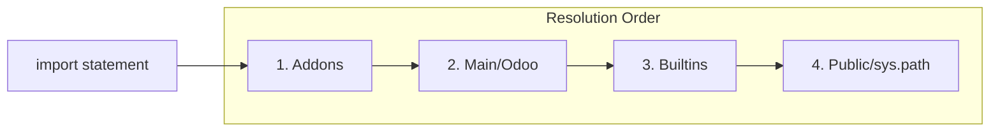
```mermaid
graph LR
    Import[import statement]
    
    subgraph "Resolution Order"
        A[1. Addons] --> B[2. Main/Odoo]
        B --> C[3. Builtins]
        C --> D[4. Public/sys.path]
    end
    
    Import --> A
```

| Entry Type | Examples | Priority |
|------------|----------|----------|
| **ADDON** | Custom addon paths | Highest |
| **MAIN** | Odoo core (`odoo/`) | High |
| **BUILTIN** | typeshed, stdlib | Medium |
| **PUBLIC** | sys.path entries | Low |

### Example: Initial Build of a Simple Addon

Consider this addon structure:

```
my_addon/
├── __manifest__.py
├── __init__.py
├── models/
│   ├── __init__.py
│   └── partner.py
```

**Build sequence**:

1. **Scan addons directory** → Find `my_addon/__manifest__.py`
2. **Create MODULE symbol** for `my_addon` → Add to `rebuild_arch`
3. **ARCH phase** for `my_addon`:
   - Parse `__init__.py`
   - Find `from . import models` → Create `models` PACKAGE symbol
   - Add `models` to `rebuild_arch`
4. **ARCH phase** for `models`:
   - Parse `models/__init__.py`
   - Find `from . import partner` → Create `partner` FILE symbol
   - Add `partner` to `rebuild_arch`
5. **ARCH phase** for `partner.py`:
   - Parse file
   - Create ClassSymbol for `Partner`
   - Create FunctionSymbols for methods (bodies deferred)
6. **All ARCH done** → Process `rebuild_arch_eval` queue
7. **ARCH_EVAL phase** for each file:
   - Resolve import types
   - Infer variable types
   - Detect Odoo fields
8. **All ARCH_EVAL done** → Process `rebuild_validation` queue
9. **VALIDATION phase** for each file:
   - Generate diagnostics
   - Publish to client

---

## 4. Build Pipeline Phases

### Phase Interaction and Queue Management

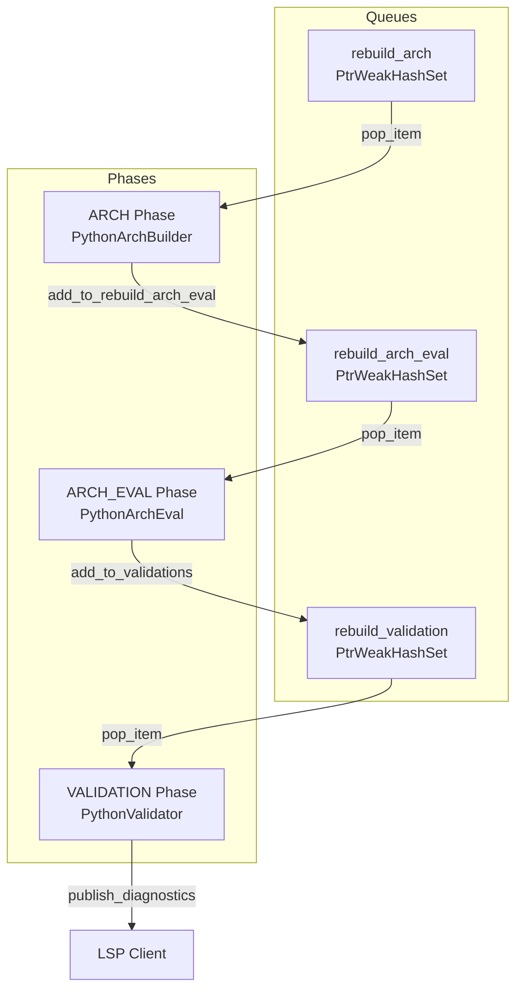
```mermaid
graph TD
    subgraph "Queues"
        QA[rebuild_arch<br/>PtrWeakHashSet]
        QE[rebuild_arch_eval<br/>PtrWeakHashSet]
        QV[rebuild_validation<br/>PtrWeakHashSet]
    end
    
    subgraph "Phases"
        PA[ARCH Phase<br/>PythonArchBuilder]
        PE[ARCH_EVAL Phase<br/>PythonArchEval]
        PV[VALIDATION Phase<br/>PythonValidator]
    end
    
    QA -->|pop_item| PA
    PA -->|add_to_rebuild_arch_eval| QE
    QE -->|pop_item| PE
    PE -->|add_to_validations| QV
    QV -->|pop_item| PV
    PV -->|publish_diagnostics| Client[LSP Client]
```

### The `pop_item` Algorithm: Dependency-Aware Selection

The `pop_item` function doesn't simply take any item from the queue—it selects the symbol with the **fewest pending dependencies** to maximize build efficiency:

```rust
fn pop_item(&mut self, step: BuildSteps) -> Option<Rc<RefCell<Symbol>>> {
    let mut selected_sym = None;
    let mut selected_count = u32::MAX;
    
    for sym in queue {
        let mut dependency_count = 0;
        
        // Count how many dependencies are still in rebuild queues
        for dep in sym.get_all_dependencies(step) {
            if dep is still in any queue {
                dependency_count += 1;
            }
        }
        
        if dependency_count < selected_count {
            selected_sym = Some(sym);
            selected_count = dependency_count;
            
            // Optimal: no pending dependencies
            if dependency_count == 0 {
                break;
            }
        }
    }
    
    // Remove and return selected symbol
    queue.remove(selected_sym);
    selected_sym
}
```

**Why this matters**: Consider files A, B, C where:
- A imports B
- B imports C

If all three are in `rebuild_arch`, the optimal order is C → B → A. The algorithm naturally selects C first (0 dependencies), then B (C is done, 0 pending), then A.

### Phase 1: ARCH (Architecture)

**Purpose**: Parse AST and build the symbol tree structure.

**Input**: File or package symbol with `build_status(ARCH) == PENDING`

**Process**:

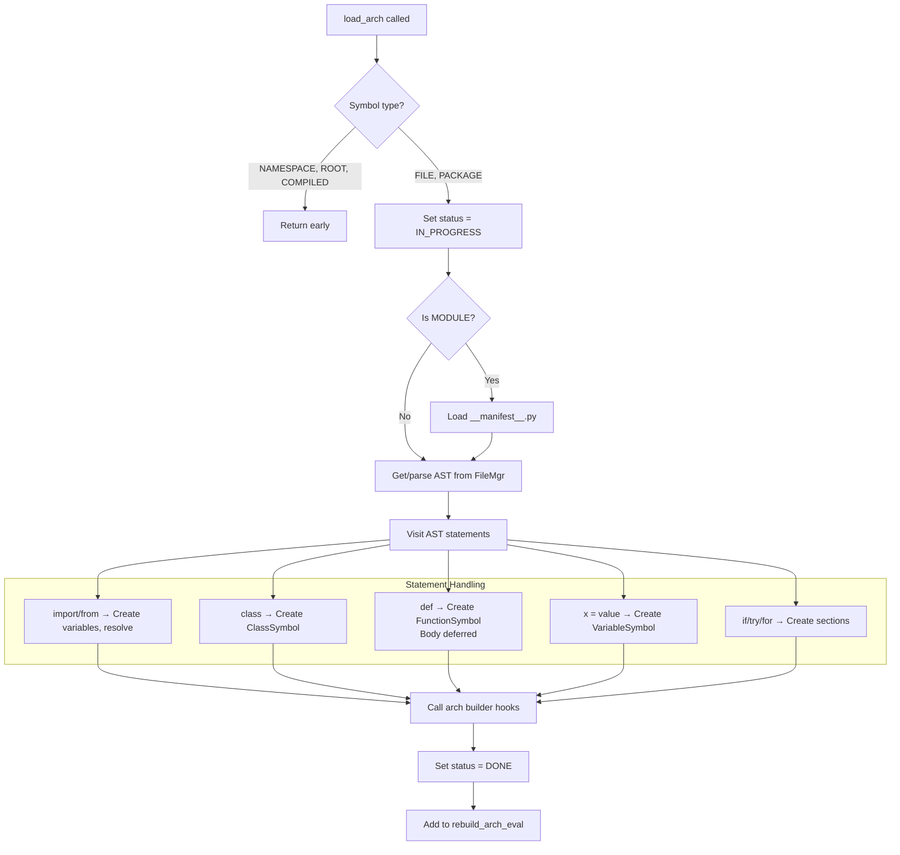
```mermaid
flowchart TD
    Start[load_arch called]
    Check{Symbol type?}
    Skip[Return early]
    
    Start --> Check
    Check -->|NAMESPACE, ROOT, COMPILED| Skip
    Check -->|FILE, PACKAGE| Continue
    
    Continue[Set status = IN_PROGRESS]
    LoadManifest{Is MODULE?}
    LoadInfo[Load __manifest__.py]
    GetAST[Get/parse AST from FileMgr]
    Visit[Visit AST statements]
    
    Continue --> LoadManifest
    LoadManifest -->|Yes| LoadInfo
    LoadManifest -->|No| GetAST
    LoadInfo --> GetAST
    GetAST --> Visit
    
    subgraph "Statement Handling"
        Import[import/from → Create variables, resolve]
        Class[class → Create ClassSymbol]
        Func[def → Create FunctionSymbol<br/>Body deferred]
        Assign[x = value → Create VariableSymbol]
        Control[if/try/for → Create sections]
    end
    
    Visit --> Import
    Visit --> Class
    Visit --> Func
    Visit --> Assign
    Visit --> Control
    
    Hooks[Call arch builder hooks]
    Done[Set status = DONE]
    Queue[Add to rebuild_arch_eval]
    
    Import --> Hooks
    Class --> Hooks
    Func --> Hooks
    Assign --> Hooks
    Control --> Hooks
    Hooks --> Done
    Done --> Queue
```

**Example**: Processing `models/partner.py`

```python
# models/partner.py
from odoo import models, fields, api

class Partner(models.Model):
    _name = 'res.partner'
    
    name = fields.Char(string="Name")
    
    @api.depends('name')
    def _compute_display_name(self):
        for record in self:
            record.display_name = record.name
```

**ARCH phase creates**:

| Symbol | Type | Notes |
|--------|------|-------|
| `models` | Variable (import) | Points to `odoo.models` |
| `fields` | Variable (import) | Points to `odoo.fields` |
| `api` | Variable (import) | Points to `odoo.api` |
| `Partner` | Class | With body range |
| `_name` | Variable | Inside Partner scope |
| `name` | Variable | Inside Partner scope |
| `_compute_display_name` | Function | Body deferred |

### Phase 2: ARCH_EVAL (Architecture Evaluation)

**Purpose**: Perform type inference and evaluate expressions.

**Input**: Symbol with `build_status(ARCH_EVAL) == PENDING` and `build_status(ARCH) == DONE`

**Process**:

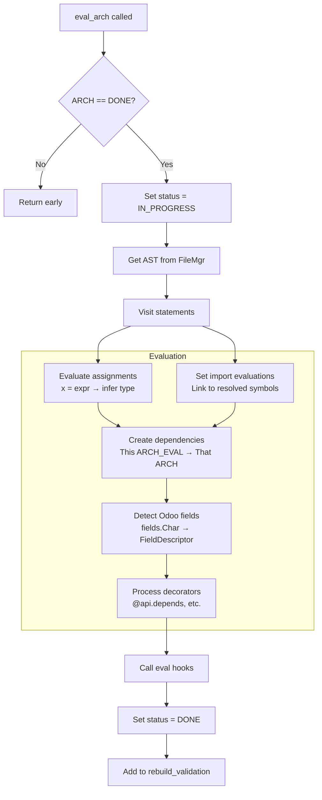
```mermaid
flowchart TD
    Start[eval_arch called]
    CheckArch{ARCH == DONE?}
    Skip[Return early]
    
    Start --> CheckArch
    CheckArch -->|No| Skip
    CheckArch -->|Yes| SetStatus[Set status = IN_PROGRESS]
    
    SetStatus --> GetAST[Get AST from FileMgr]
    GetAST --> VisitStmts[Visit statements]
    
    subgraph "Evaluation"
        EvalAssign[Evaluate assignments<br/>x = expr → infer type]
        EvalImport[Set import evaluations<br/>Link to resolved symbols]
        CreateDeps[Create dependencies<br/>This ARCH_EVAL → That ARCH]
        DetectFields[Detect Odoo fields<br/>fields.Char → FieldDescriptor]
        ProcessDeco[Process decorators<br/>@api.depends, etc.]
    end
    
    VisitStmts --> EvalAssign
    VisitStmts --> EvalImport
    EvalAssign --> CreateDeps
    EvalImport --> CreateDeps
    CreateDeps --> DetectFields
    DetectFields --> ProcessDeco
    
    ProcessDeco --> Hooks[Call eval hooks]
    Hooks --> Done[Set status = DONE]
    Done --> Queue[Add to rebuild_validation]
```

**Example**: Evaluating `partner.py`

For the `Partner` class:

1. **Import evaluation**: `models` → `odoo.models.Model` (weak reference)
2. **`_name` evaluation**: String literal `"res.partner"`
3. **`name` evaluation**: `fields.Char(...)` → `FieldDescriptor` type
4. **Dependency creation**: `partner.py` ARCH_EVAL depends on `odoo.models` ARCH

```python
# After ARCH_EVAL:
# Partner.name has evaluation pointing to fields.Char class
# Partner is registered with Model registry as 'res.partner'
```

### Phase 3: VALIDATION

**Purpose**: Generate diagnostics (errors, warnings) for the file.

**Input**: Symbol with `build_status(VALIDATION) == PENDING` and `build_status(ARCH_EVAL) == DONE`

**Process**:

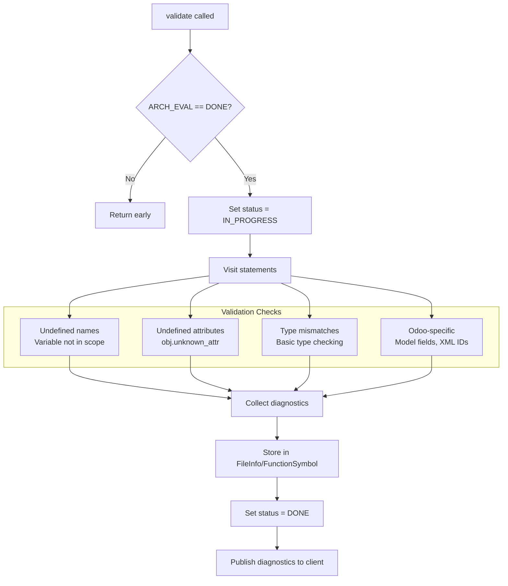
```mermaid
flowchart TD
    Start[validate called]
    CheckEval{ARCH_EVAL == DONE?}
    Skip[Return early]
    
    Start --> CheckEval
    CheckEval -->|No| Skip
    CheckEval -->|Yes| SetStatus[Set status = IN_PROGRESS]
    
    SetStatus --> VisitStmts[Visit statements]
    
    subgraph "Validation Checks"
        CheckNames[Undefined names<br/>Variable not in scope]
        CheckAttrs[Undefined attributes<br/>obj.unknown_attr]
        CheckTypes[Type mismatches<br/>Basic type checking]
        CheckOdoo[Odoo-specific<br/>Model fields, XML IDs]
    end
    
    VisitStmts --> CheckNames
    VisitStmts --> CheckAttrs
    VisitStmts --> CheckTypes
    VisitStmts --> CheckOdoo
    
    CheckNames --> Collect[Collect diagnostics]
    CheckAttrs --> Collect
    CheckTypes --> Collect
    CheckOdoo --> Collect
    
    Collect --> Store[Store in FileInfo/FunctionSymbol]
    Store --> Done[Set status = DONE]
    Done --> Publish[Publish diagnostics to client]
```

**Example**: Validating `partner.py`

```python
class Partner(models.Model):
    _name = 'res.partner'
    
    def test_method(self):
        x = unknown_variable  # OLS01001: Undefined name 'unknown_variable'
        self.unknown_field    # OLS01002: Undefined attribute 'unknown_field'
```

---

## 5. Dependency System

### Dependency Structure

Dependencies are stored in a **2D array** structure:

```
dependencies[step][level]
```

- **step**: The build step that has the dependency (which step of *this* symbol needs something)
- **level**: The required level from the dependency (which step of *that* symbol must be done)

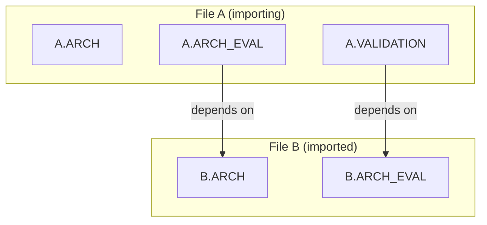
```mermaid
graph TD
    subgraph "File A (importing)"
        A_ARCH[A.ARCH]
        A_EVAL[A.ARCH_EVAL]
        A_VALID[A.VALIDATION]
    end
    
    subgraph "File B (imported)"
        B_ARCH[B.ARCH]
        B_EVAL[B.ARCH_EVAL]
    end
    
    A_EVAL -->|depends on| B_ARCH
    A_VALID -->|depends on| B_EVAL
```

### Storage Structure

```rust
// In FileSymbol
pub dependencies: Vec<Vec<Option<PtrWeakHashSet<Weak<RefCell<Symbol>>>>>>,
// dependencies[ARCH_EVAL][ARCH] = Set of symbols whose ARCH must be done 
//                                  before this symbol's ARCH_EVAL can run

pub dependents: Vec<Vec<Option<PtrWeakHashSet<Weak<RefCell<Symbol>>>>>>,
// dependents[ARCH][ARCH_EVAL] = Set of symbols whose ARCH_EVAL depends 
//                                on this symbol's ARCH
```

### How Dependencies Are Created

#### During Import Resolution

When file A imports from file B:

```python
# file_a.py
from file_b import SomeClass
```

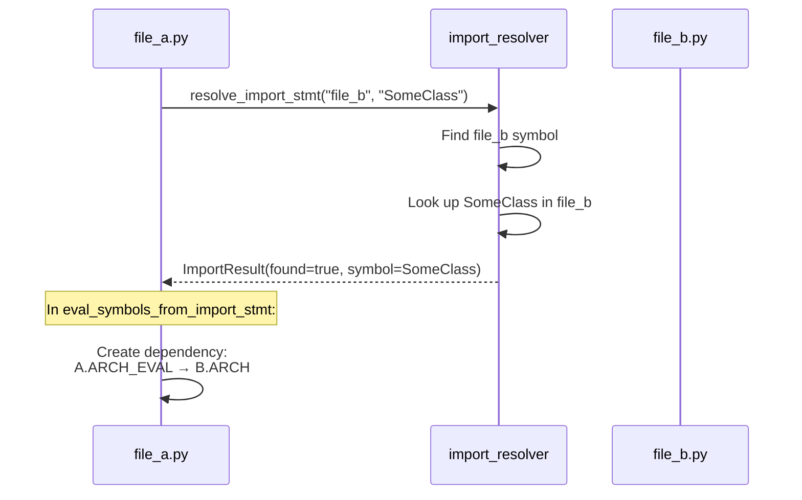
```mermaid
sequenceDiagram
    participant A as file_a.py
    participant Resolver as import_resolver
    participant B as file_b.py
    
    A->>Resolver: resolve_import_stmt("file_b", "SomeClass")
    Resolver->>Resolver: Find file_b symbol
    Resolver->>Resolver: Look up SomeClass in file_b
    Resolver-->>A: ImportResult(found=true, symbol=SomeClass)
    
    Note over A: In eval_symbols_from_import_stmt:
    A->>A: Create dependency:<br/>A.ARCH_EVAL → B.ARCH
```

**Code location** (`python_arch_eval.rs:478-481`):

```rust
if let Some(import_file) = file_of_import_symbol {
    let import_file = import_file.upgrade().unwrap();
    if !Rc::ptr_eq(&self.file, &import_file) {
        self.file.borrow_mut().add_dependency(
            &mut import_file.borrow_mut(), 
            self.current_step,      // ARCH_EVAL
            BuildSteps::ARCH        // depends on imported file's ARCH
        );
    }
}
```

#### During Type Evaluation

When evaluating an expression that references another file:

```python
# file_a.py
from file_b import helper

result = helper.process()  # Type inference needs helper's type
```

Dependencies are collected in `Evaluation::eval_from_ast` and inserted via `Symbol::insert_dependencies`.

### Dependency Example: Import Chain

Consider this import chain:

```python
# c.py
VALUE = 42

# b.py  
from c import VALUE
DOUBLED = VALUE * 2

# a.py
from b import DOUBLED
print(DOUBLED)
```

**Dependency graph**:

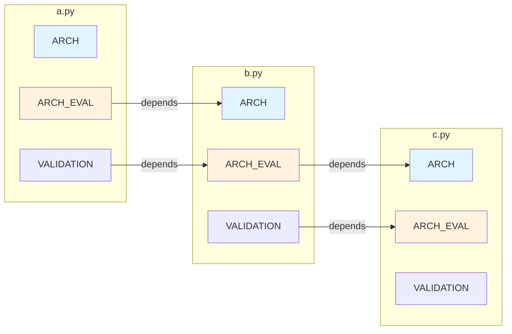
```mermaid
graph LR
    subgraph "a.py"
        a_arch[ARCH]
        a_eval[ARCH_EVAL]
        a_valid[VALIDATION]
    end
    
    subgraph "b.py"
        b_arch[ARCH]
        b_eval[ARCH_EVAL]
        b_valid[VALIDATION]
    end
    
    subgraph "c.py"
        c_arch[ARCH]
        c_eval[ARCH_EVAL]
        c_valid[VALIDATION]
    end
    
    a_eval -->|depends| b_arch
    a_valid -->|depends| b_eval
    
    b_eval -->|depends| c_arch
    b_valid -->|depends| c_eval
    
    style a_arch fill:#e1f5fe
    style b_arch fill:#e1f5fe
    style c_arch fill:#e1f5fe
    style a_eval fill:#fff3e0
    style b_eval fill:#fff3e0
    style c_eval fill:#fff3e0
```

**Build order** (determined by `pop_item`):

1. c.ARCH (no dependencies)
2. b.ARCH (no dependencies)
3. a.ARCH (no dependencies)
4. c.ARCH_EVAL (c.ARCH done)
5. b.ARCH_EVAL (c.ARCH done, which it depends on)
6. a.ARCH_EVAL (b.ARCH done)
7. c.VALIDATION
8. b.VALIDATION
9. a.VALIDATION

---

## 6. Partial Rebuilds

When a file changes, only affected symbols need to be rebuilt.

### File Change Flow

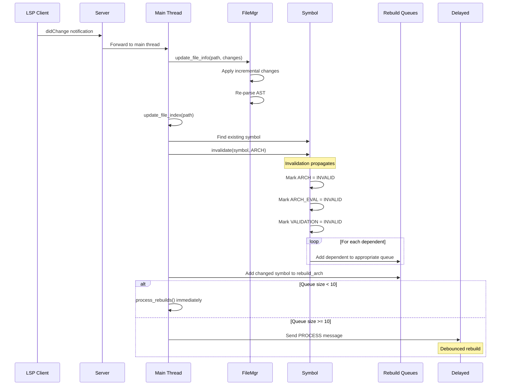
```mermaid
sequenceDiagram
    participant Client as LSP Client
    participant Server as Server
    participant Main as Main Thread
    participant FileMgr as FileMgr
    participant Symbol as Symbol
    participant Queue as Rebuild Queues
    
    Client->>Server: didChange notification
    Server->>Main: Forward to main thread
    Main->>FileMgr: update_file_info(path, changes)
    FileMgr->>FileMgr: Apply incremental changes
    FileMgr->>FileMgr: Re-parse AST
    
    Main->>Main: update_file_index(path)
    Main->>Symbol: Find existing symbol
    Main->>Symbol: invalidate(symbol, ARCH)
    
    Note over Symbol: Invalidation propagates
    Symbol->>Symbol: Mark ARCH = INVALID
    Symbol->>Symbol: Mark ARCH_EVAL = INVALID
    Symbol->>Symbol: Mark VALIDATION = INVALID
    
    loop For each dependent
        Symbol->>Queue: Add dependent to appropriate queue
    end
    
    Main->>Queue: Add changed symbol to rebuild_arch
    
    alt Queue size < 10
        Main->>Main: process_rebuilds() immediately
    else Queue size >= 10
        Main->>Delayed: Send PROCESS message
        Note over Delayed: Debounced rebuild
    end
```

### Invalidation Propagation

The `invalidate` function recursively marks dependents as needing rebuild:

```rust
pub fn invalidate(session: &mut SessionInfo, symbol: Rc<RefCell<Symbol>>, step: &BuildSteps) {
    let mut to_invalidate = VecDeque::from([symbol.clone()]);
    
    while let Some(sym) = to_invalidate.pop_front() {
        // Mark this symbol's subsequent steps as invalid
        sym.borrow_mut().set_build_status(*step, BuildStatus::INVALID);
        // Also invalidate later steps
        if *step <= BuildSteps::ARCH_EVAL {
            sym.borrow_mut().set_build_status(BuildSteps::ARCH_EVAL, BuildStatus::INVALID);
        }
        sym.borrow_mut().set_build_status(BuildSteps::VALIDATION, BuildStatus::INVALID);
        
        // Find and queue dependents
        for (level_index, dependents_at_level) in sym.dependents()[*step].iter().enumerate() {
            for dependent in dependents_at_level {
                match level_index {
                    0 => session.sync_odoo.add_to_rebuild_arch(dependent),
                    1 => session.sync_odoo.add_to_rebuild_arch_eval(dependent),
                    2 => session.sync_odoo.add_to_validations(dependent),
                }
            }
        }
        
        // Also invalidate child symbols (classes, functions in file)
        for child in sym.all_module_symbol() {
            to_invalidate.push_back(child);
        }
    }
}
```

### Example: Changing a Base Module

```python
# base_utils.py (BEFORE)
def helper():
    return 42

# base_utils.py (AFTER)
def helper():
    return "changed"  # Return type changed!
```

**Files depending on base_utils.py**:
- `module_a.py`: `from base_utils import helper`
- `module_b.py`: `from base_utils import helper`

**Invalidation cascade**:

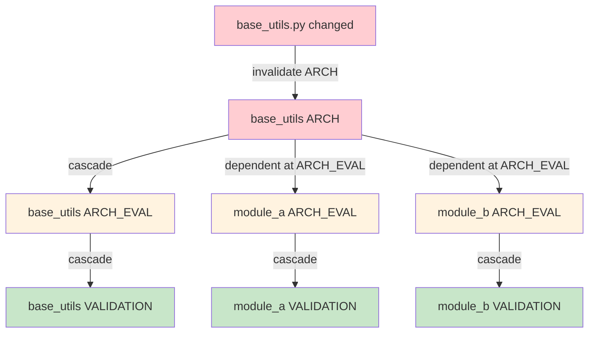
```mermaid
graph TD
    Change[base_utils.py changed]
    
    BU_ARCH[base_utils ARCH]
    BU_EVAL[base_utils ARCH_EVAL]
    BU_VALID[base_utils VALIDATION]
    
    MA_EVAL[module_a ARCH_EVAL]
    MA_VALID[module_a VALIDATION]
    
    MB_EVAL[module_b ARCH_EVAL]
    MB_VALID[module_b VALIDATION]
    
    Change -->|invalidate ARCH| BU_ARCH
    BU_ARCH -->|cascade| BU_EVAL
    BU_EVAL -->|cascade| BU_VALID
    
    BU_ARCH -->|dependent at ARCH_EVAL| MA_EVAL
    MA_EVAL -->|cascade| MA_VALID
    
    BU_ARCH -->|dependent at ARCH_EVAL| MB_EVAL
    MB_EVAL -->|cascade| MB_VALID
    
    style Change fill:#ffcdd2
    style BU_ARCH fill:#ffcdd2
    style BU_EVAL fill:#fff3e0
    style BU_VALID fill:#c8e6c9
    style MA_EVAL fill:#fff3e0
    style MA_VALID fill:#c8e6c9
    style MB_EVAL fill:#fff3e0
    style MB_VALID fill:#c8e6c9
```

**Rebuild queues after invalidation**:

| Queue | Contents |
|-------|----------|
| `rebuild_arch` | base_utils |
| `rebuild_arch_eval` | module_a, module_b |
| `rebuild_validation` | (populated after ARCH_EVAL completes) |

### Handling Unresolved Imports

When an import cannot be resolved, the importing file is added to `not_found_symbols`:

```rust
// In python_arch_builder.rs
if !import_result.found {
    self.entry_point.borrow_mut().not_found_symbols.insert(self.file.clone());
    self.file.borrow_mut().not_found_paths_mut().push(
        (self.current_step, import_result.file_tree.clone())
    );
}
```

When a new file is created that matches the unresolved path:

```rust
// In odoo.rs - search_symbols_to_rebuild
for sym in not_found_symbols {
    for (step, not_found_tree) in sym.not_found_paths() {
        if new_file_tree.starts_with(not_found_tree) {
            // Add to appropriate rebuild queue
            match step {
                ARCH => add_to_rebuild_arch(sym),
                ARCH_EVAL => add_to_rebuild_arch_eval(sym),
                VALIDATION => add_to_validations(sym),
            }
        }
    }
}
```

---

## 7. Interrupt and Debounce Mechanisms

### Interrupt Mechanism

Two atomic boolean flags control build interruption:

| Flag | Purpose | Checked in |
|------|---------|------------|
| `interrupt_rebuild` | Pause current rebuild to handle request | VALIDATION phase only |
| `terminate_rebuild` | Shutdown signal | All phases |

**Why only interrupt VALIDATION?**
- ARCH and ARCH_EVAL build the symbol tree structure
- Interrupting them could leave the tree in an inconsistent state
- VALIDATION only generates diagnostics—safe to defer

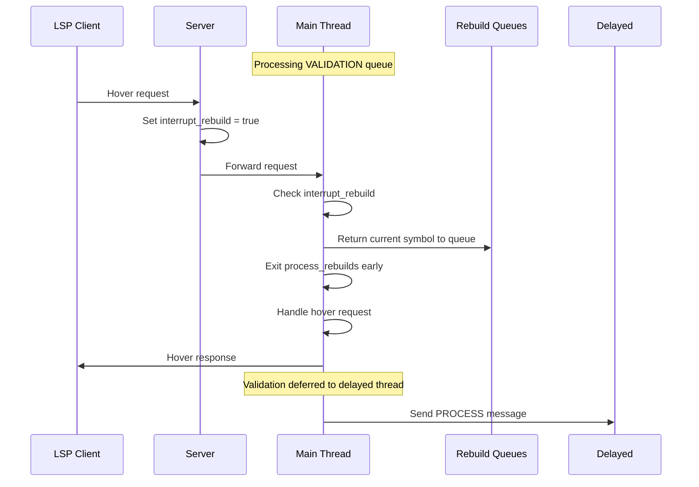
```mermaid
sequenceDiagram
    participant Client as LSP Client
    participant Server as Server
    participant Main as Main Thread
    participant Queue as Rebuild Queues
    
    Note over Main: Processing VALIDATION queue
    Client->>Server: Hover request
    Server->>Server: Set interrupt_rebuild = true
    Server->>Main: Forward request
    
    Main->>Main: Check interrupt_rebuild
    Main->>Queue: Return current symbol to queue
    Main->>Main: Exit process_rebuilds early
    Main->>Main: Handle hover request
    Main->>Client: Hover response
    
    Note over Main: Validation deferred to delayed thread
    Main->>Delayed: Send PROCESS message
```

**Code location** (`odoo.rs` in `process_rebuilds`):

```rust
// In VALIDATION processing
if session.sync_odoo.interrupt_rebuild.load(Ordering::SeqCst) {
    // Re-add symbol to queue for later processing
    session.sync_odoo.add_to_validations(sym_rc.clone());
    // Signal delayed thread to continue later
    session.request_delayed_rebuild();
    return true;  // Exit rebuild loop
}
```

### Debounce Mechanism

File changes are debounced to avoid excessive rebuilds during rapid typing.

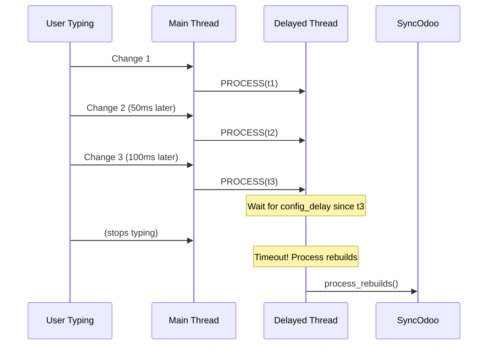
```mermaid
sequenceDiagram
    participant User as User Typing
    participant Main as Main Thread
    participant Delayed as Delayed Thread
    participant Odoo as SyncOdoo
    
    User->>Main: Change 1
    Main->>Delayed: PROCESS(t1)
    
    User->>Main: Change 2 (50ms later)
    Main->>Delayed: PROCESS(t2)
    
    User->>Main: Change 3 (100ms later)
    Main->>Delayed: PROCESS(t3)
    
    Note over Delayed: Wait for config_delay since t3
    
    User->>Main: (stops typing)
    
    Note over Delayed: Timeout! Process rebuilds
    Delayed->>Odoo: process_rebuilds()
```

**Configuration**:

| Setting | Default | Range | Purpose |
|---------|---------|-------|---------|
| `auto_refresh_delay` | 1000ms | 1000-15000ms | Debounce period |

**Code location** (`threads.rs:227-298`):

```rust
pub fn delayed_changes_process_thread(...) {
    const MAX_DELAY: u64 = 15000;
    const MIN_DELAY: u64 = 1000;
    let mut config_delay = Duration::from_millis(
        clamp(config.auto_refresh_delay, MIN_DELAY, MAX_DELAY)
    );
    
    loop {
        let msg = receiver.recv_timeout(to_wait);
        
        match msg {
            Ok(PROCESS(timestamp)) => {
                // Reset timer to config_delay after this timestamp
                to_wait = timestamp + config_delay - Instant::now();
            }
            Ok(UPDATE_DELAY(d)) => {
                config_delay = Duration::from_millis(clamp(d, MIN_DELAY, MAX_DELAY));
            }
            Err(Timeout) => {
                // Debounce period elapsed, process rebuilds
                SyncOdoo::process_rebuilds(&mut session, false);
            }
        }
    }
}
```

### Restart Mechanism

When too many file changes occur (e.g., git checkout), a full restart is triggered:

```rust
const MAX_WATCHED_FILES_UPDATES_BEFORE_RESTART: u32 = 200;

if watched_file_updates > MAX_WATCHED_FILES_UPDATES_BEFORE_RESTART {
    delayed_sender.send(DelayedProcessingMessage::RESTART);
}
```

**Restart flow**:

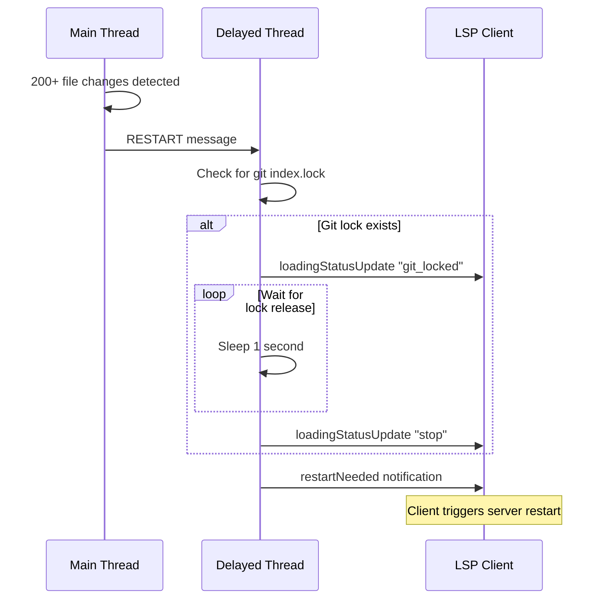
```mermaid
sequenceDiagram
    participant Main as Main Thread
    participant Delayed as Delayed Thread
    participant Client as LSP Client
    
    Main->>Main: 200+ file changes detected
    Main->>Delayed: RESTART message
    
    Delayed->>Delayed: Check for git index.lock
    
    alt Git lock exists
        Delayed->>Client: loadingStatusUpdate "git_locked"
        loop Wait for lock release
            Delayed->>Delayed: Sleep 1 second
        end
        Delayed->>Client: loadingStatusUpdate "stop"
    end
    
    Delayed->>Client: restartNeeded notification
    Note over Client: Client triggers server restart
```

---

## 8. Complete Lifecycle Diagram

This diagram shows the complete lifecycle of the language server, from startup through normal operation:

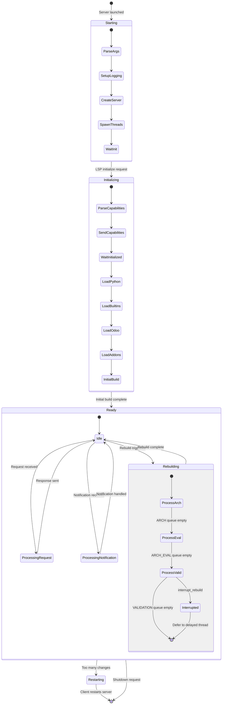
```mermaid
stateDiagram-v2
    [*] --> Starting: Server launched
    
    state Starting {
        [*] --> ParseArgs
        ParseArgs --> SetupLogging
        SetupLogging --> CreateServer
        CreateServer --> SpawnThreads
        SpawnThreads --> WaitInit
    }
    
    Starting --> Initializing: LSP initialize request
    
    state Initializing {
        [*] --> ParseCapabilities
        ParseCapabilities --> SendCapabilities
        SendCapabilities --> WaitInitialized
        WaitInitialized --> LoadPython
        LoadPython --> LoadBuiltins
        LoadBuiltins --> LoadOdoo
        LoadOdoo --> LoadAddons
        LoadAddons --> InitialBuild
    }
    
    Initializing --> Ready: Initial build complete
    
    state Ready {
        [*] --> Idle
        
        Idle --> ProcessingRequest: Request received
        ProcessingRequest --> Idle: Response sent
        
        Idle --> ProcessingNotification: Notification received
        ProcessingNotification --> Idle: Notification handled
        
        Idle --> Rebuilding: Rebuild triggered
        Rebuilding --> Idle: Rebuild complete
        
        state Rebuilding {
            [*] --> ProcessArch
            ProcessArch --> ProcessEval: ARCH queue empty
            ProcessEval --> ProcessValid: ARCH_EVAL queue empty
            ProcessValid --> [*]: VALIDATION queue empty
            
            ProcessValid --> Interrupted: interrupt_rebuild
            Interrupted --> [*]: Defer to delayed thread
        }
    }
    
    Ready --> Restarting: Too many changes
    Restarting --> [*]: Client restarts server
    
    Ready --> [*]: Shutdown request
```

### Detailed Rebuild Cycle

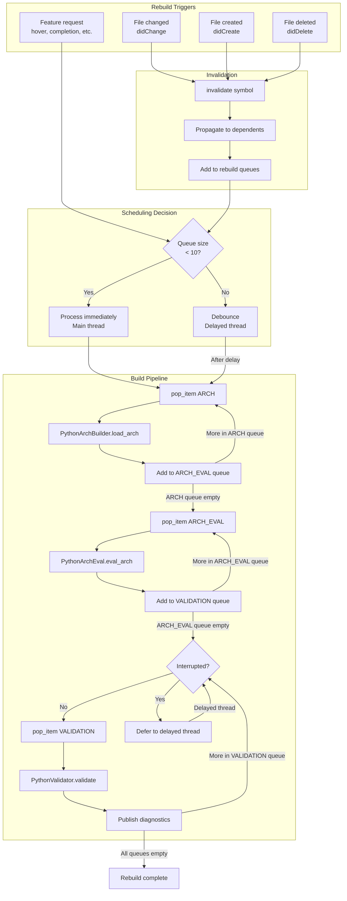
```mermaid
flowchart TB
    subgraph Trigger["Rebuild Triggers"]
        FileChange[File changed<br/>didChange]
        FileCreate[File created<br/>didCreate]
        FileDelete[File deleted<br/>didDelete]
        Request[Feature request<br/>hover, completion, etc.]
    end
    
    subgraph Invalidation["Invalidation"]
        Invalidate[invalidate symbol]
        PropDeps[Propagate to dependents]
        AddQueue[Add to rebuild queues]
    end
    
    subgraph Scheduling["Scheduling Decision"]
        CheckSize{Queue size<br/>< 10?}
        Immediate[Process immediately<br/>Main thread]
        Debounced[Debounce<br/>Delayed thread]
    end
    
    subgraph Pipeline["Build Pipeline"]
        PopArch[pop_item ARCH]
        BuildArch[PythonArchBuilder.load_arch]
        QueueEval[Add to ARCH_EVAL queue]
        
        PopEval[pop_item ARCH_EVAL]
        BuildEval[PythonArchEval.eval_arch]
        QueueValid[Add to VALIDATION queue]
        
        CheckInterrupt{Interrupted?}
        PopValid[pop_item VALIDATION]
        BuildValid[PythonValidator.validate]
        Publish[Publish diagnostics]
        
        Defer[Defer to delayed thread]
    end
    
    FileChange --> Invalidate
    FileCreate --> Invalidate
    FileDelete --> Invalidate
    Request --> CheckSize
    
    Invalidate --> PropDeps
    PropDeps --> AddQueue
    AddQueue --> CheckSize
    
    CheckSize -->|Yes| Immediate
    CheckSize -->|No| Debounced
    
    Immediate --> PopArch
    Debounced -->|After delay| PopArch
    
    PopArch --> BuildArch
    BuildArch --> QueueEval
    QueueEval -->|More in ARCH queue| PopArch
    QueueEval -->|ARCH queue empty| PopEval
    
    PopEval --> BuildEval
    BuildEval --> QueueValid
    QueueValid -->|More in ARCH_EVAL queue| PopEval
    QueueValid -->|ARCH_EVAL queue empty| CheckInterrupt
    
    CheckInterrupt -->|Yes| Defer
    CheckInterrupt -->|No| PopValid
    
    PopValid --> BuildValid
    BuildValid --> Publish
    Publish -->|More in VALIDATION queue| CheckInterrupt
    Publish -->|All queues empty| Done[Rebuild complete]
    
    Defer -->|Delayed thread| CheckInterrupt
```

### Message Flow Summary

```mermaid
flowchart LR
    subgraph Client["LSP Client"]
        Editor[Editor]
    end
    
    subgraph Server["Server Process"]
        Router[Message Router]
        
        subgraph Main["Main Thread"]
            ReqHandler[Request Handler]
            NotifHandler[Notification Handler]
            ImmediateBuild[Immediate Rebuilds]
        end
        
        subgraph Delayed["Delayed Thread"]
            Debouncer[Debouncer]
            DeferredBuild[Deferred Rebuilds]
        end
        
        subgraph State["Shared State"]
            SyncOdoo["SyncOdoo (Arc Mutex)"]
            Queues[Rebuild Queues]
            Flags[Interrupt Flags]
        end
    end
    
    Editor <-->|LSP messages| Router
    Router -->|Requests| ReqHandler
    Router -->|Notifications| NotifHandler
    
    ReqHandler <-->|Lock| SyncOdoo
    NotifHandler <-->|Lock| SyncOdoo
    
    ReqHandler -->|Set interrupt| Flags
    NotifHandler -->|Add to queue| Queues
    NotifHandler -->|PROCESS msg| Debouncer
    
    ImmediateBuild <-->|Lock| SyncOdoo
    DeferredBuild <-->|Lock| SyncOdoo
    
    Debouncer -->|After timeout| DeferredBuild
    
    ReqHandler -->|Response| Router
    ImmediateBuild -->|Diagnostics| Router
    DeferredBuild -->|Diagnostics| Router
```

---

## Appendix: Key Code Locations

| Component | File | Key Functions |
|-----------|------|---------------|
| Server startup | `main.rs` | `main()` |
| LSP initialization | `server.rs` | `initialize()`, `run()` |
| Thread management | `threads.rs` | `message_processor_thread_main()`, `delayed_changes_process_thread()` |
| Main orchestration | `core/odoo.rs` | `init()`, `process_rebuilds()`, `pop_item()` |
| ARCH phase | `core/python_arch_builder.rs` | `load_arch()` |
| ARCH_EVAL phase | `core/python_arch_eval.rs` | `eval_arch()` |
| VALIDATION phase | `core/python_validator.rs` | `validate()` |
| Import resolution | `core/import_resolver.rs` | `resolve_import_stmt()` |
| Dependency management | `core/symbols/symbol.rs` | `add_dependency()`, `invalidate()` |
| File management | `core/file_mgr.rs` | `update_file_info()` |

---

## Related Documentation

- [Python Core Onboarding Guide](python-core-onboarding.md) - Introduction to the codebase
- [Python Build Pipeline](python-build-pipeline.md) - Detailed phase documentation
