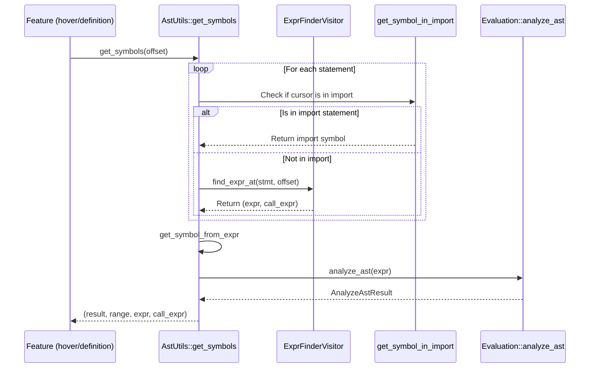
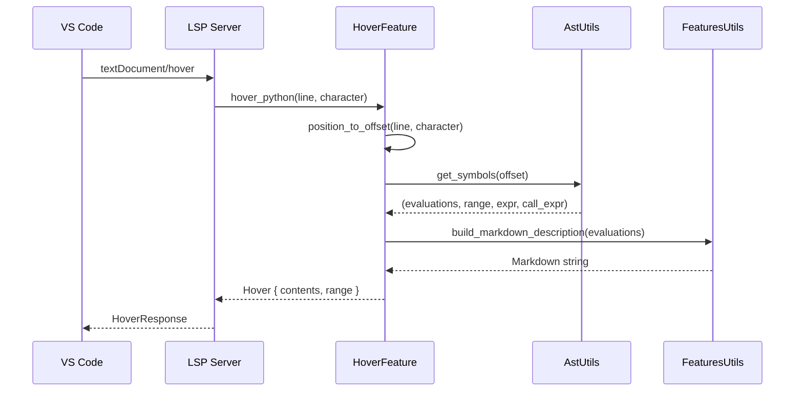
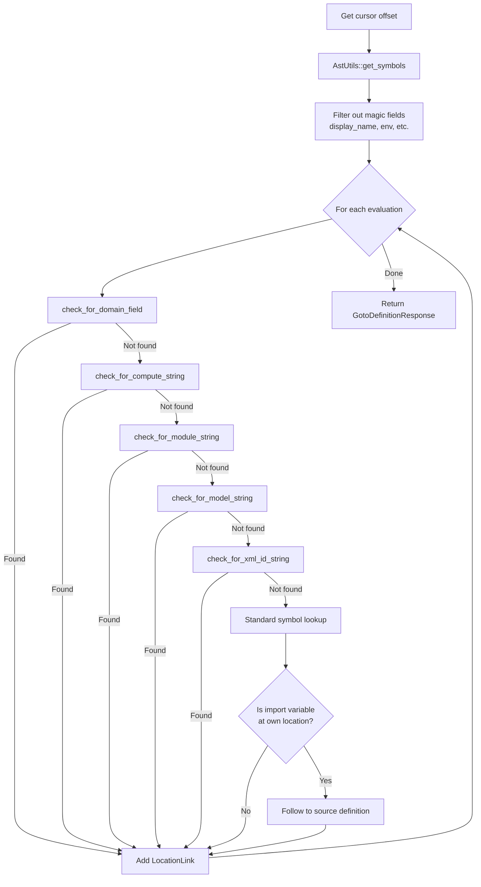
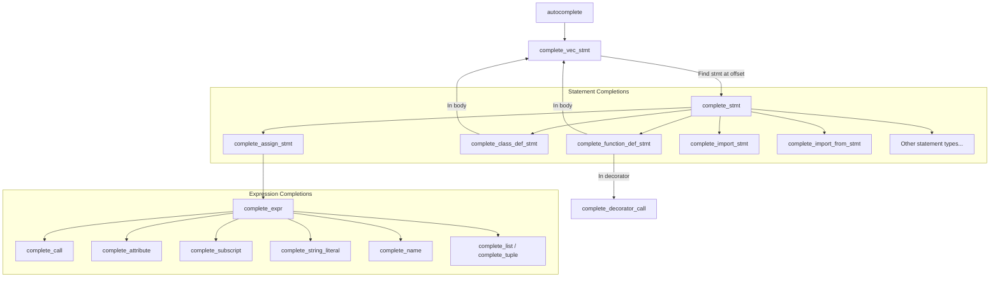
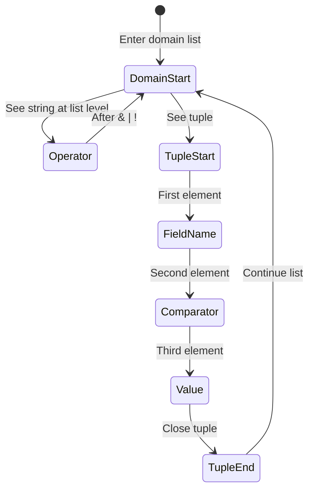
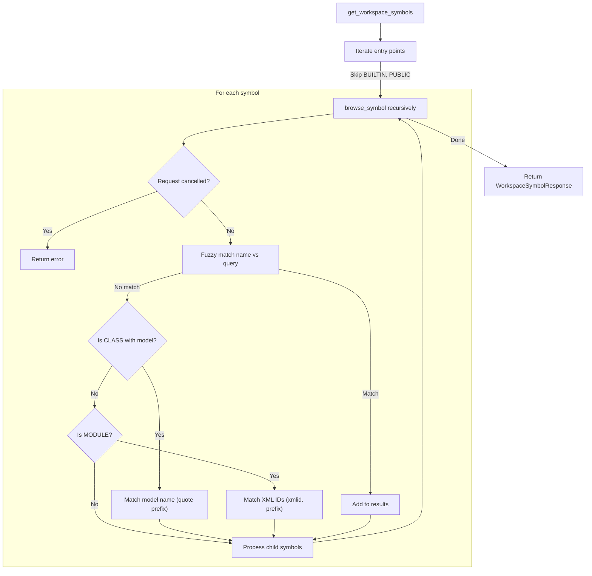
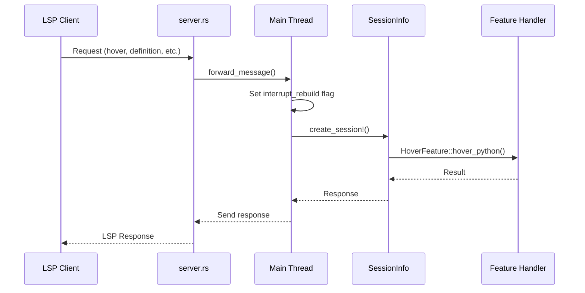

# LSP Features Guide - Odoo Language Server

> **Audience**: Developers who want to understand how the Odoo Language Server implements LSP features.  
> **Scope**: This guide covers all LSP features (hover, definition, completion, references, document symbols, workspace symbols) and their implementations.  
> **Prerequisites**: Familiarity with the [Python Core Onboarding Guide](python-core-onboarding.md), understanding of LSP concepts, and basic Rust knowledge.

## Table of Contents

1. [Introduction](#1-introduction)
2. [Module Structure](#2-module-structure)
3. [Common Utilities](#3-common-utilities)
4. [Hover Feature](#4-hover-feature)
5. [Go-to-Definition Feature](#5-go-to-definition-feature)
6. [Completion Feature](#6-completion-feature)
7. [References Feature](#7-references-feature)
8. [Document Symbols Feature](#8-document-symbols-feature)
9. [Workspace Symbols Feature](#9-workspace-symbols-feature)
10. [Request Flow](#10-request-flow)

---

## 1. Introduction

The `features` module implements all Language Server Protocol (LSP) features that provide IDE functionality to users. Each feature handles a specific type of request from the client (e.g., VS Code) and returns appropriate responses.

### Supported Features

| LSP Method | Feature | Python | XML | CSV |
|------------|---------|--------|-----|-----|
| `textDocument/hover` | Hover | ✅ | ✅ | ❌ |
| `textDocument/definition` | Go-to-Definition | ✅ | ✅ | ❌ |
| `textDocument/completion` | Autocompletion | ✅ | ❌ | ❌ |
| `textDocument/references` | Find References | ❌ | ✅ | ❌ |
| `textDocument/documentSymbol` | Document Outline | ✅ | ✅ | ❌ |
| `workspace/symbol` | Global Symbol Search | ✅ | ✅ (XML IDs) | ❌ |

### Design Principles

1. **File Type Dispatch**: Each feature has separate handlers for Python, XML, and CSV files
2. **Odoo-Aware**: Special handling for models, fields, domains, decorators, and XML IDs
3. **Lazy Symbol Resolution**: Symbols are built on-demand when features need them
4. **Cancellation Support**: Long-running operations check for cancellation periodically

---

## 2. Module Structure

```
src/features/
├── mod.rs                 # Module exports
├── hover.rs               # textDocument/hover implementation
├── definition.rs          # textDocument/definition implementation
├── completion.rs          # textDocument/completion implementation
├── references.rs          # textDocument/references implementation
├── document_symbols.rs    # textDocument/documentSymbol implementation
├── workspace_symbols.rs   # workspace/symbol implementation
├── ast_utils.rs           # AST traversal utilities (ExprFinderVisitor)
├── features_utils.rs      # Shared utilities (markdown building, type info)
├── xml_ast_utils.rs       # XML document analysis utilities
└── node_index_ast.rs      # AST node indexing (from Ruff)
```

### Module Exports (`mod.rs`)

```rust
pub mod ast_utils;
pub mod completion;
pub mod definition;
pub mod document_symbols;
pub mod features_utils;
pub mod hover;
pub mod node_index_ast;
pub mod references;
pub mod workspace_symbols;
pub mod xml_ast_utils;
```

---

## 3. Common Utilities

### 3.1 AST Utilities (`ast_utils.rs`)

The `AstUtils` struct provides the core symbol-finding functionality used by hover, definition, and other features.

#### Key Function: `get_symbols`

```rust
pub fn get_symbols<'a>(
    session: &mut SessionInfo,
    file_info_ast: &'a FileInfoAst,
    file_symbol: &Rc<RefCell<Symbol>>,
    offset: u32
) -> (AnalyzeAstResult, Option<TextRange>, Option<ExprOrIdent<'a>>, Option<ExprCall>)
```

This is the main entry point for finding symbols at a cursor position.

**Returns:**
- `AnalyzeAstResult`: Contains evaluations (symbol types) and diagnostics
- `TextRange`: The range of the found expression
- `ExprOrIdent`: The AST node at the position (expression or identifier)
- `ExprCall`: The enclosing call expression (if any, used for completion context)

**Flow:**



#### `ExprFinderVisitor`

A visitor pattern implementation that traverses the AST to find the expression at a given offset.

```rust
pub struct ExprFinderVisitor<'a> {
    offset: TextSize,           // Target cursor position
    expr: Option<ExprOrIdent<'a>>,     // Found expression/identifier
    last_call_expr: Option<&'a ExprCall>, // Last call expression (for context)
}
```

**Key Behaviors:**
- Tracks the innermost expression containing the offset
- Records the last `ExprCall` node (used for parameter completion)
- Handles special cases: aliases, except handlers, parameters, keywords, patterns

#### Import Handling

The `get_symbol_in_import` function handles the special case of import statements where symbols aren't directly visible in the file's symbol tree:

```python
import odoo.addons.sale  # Cursor on "sale" -> resolve the module
from odoo import models  # Cursor on "models" -> resolve the symbol
```

### 3.2 Features Utilities (`features_utils.rs`)

Provides shared functionality for building hover information and resolving special strings.

#### Key Types

```rust
/// Represents the signature of a callable (function/method)
pub struct CallableSignature {
    pub arguments: String,   // e.g., "(self, vals: dict)"
    pub return_types: String, // e.g., "RecordSet"
}

/// Type information for display in hover/completion
pub enum TypeInfo {
    CALLABLE(CallableSignature),  // Function with signature
    VALUE(String),                // Variable with type
}
```

#### Markdown Description Building

The `build_markdown_description` function creates hover content:

```rust
pub fn build_markdown_description(
    session: &mut SessionInfo,
    file_symbol: Option<Rc<RefCell<Symbol>>>,
    file_path: Option<&String>,
    evals: &Vec<Evaluation>,
    call_expr: &Option<ExprCall>,
    offset: Option<usize>
) -> String
```

**Output Structure:**
```markdown
(tag) **name**: type

---

See also: path/to/file.py

Module: module_name
Docstring content...
```

#### Field Resolution Functions

These functions resolve special string literals to their corresponding symbols:

| Function | Purpose | Example |
|----------|---------|---------|
| `find_kwarg_methods_symbols` | `compute`, `inverse`, `search` kwargs | `compute="_compute_total"` |
| `find_simple_decorator_field_symbol` | `@api.onchange`, `@api.constrains` | `@api.onchange('field')` |
| `find_nested_fields` | Dotted field paths | `related="partner_id.name"` |
| `find_domain_param_symbols` | Domain field references | `domain=[('field', '=', val)]` |
| `find_argument_symbols` | Entry point for positional/keyword args | Dispatches to specific handlers |

### 3.3 XML Utilities (`xml_ast_utils.rs`)

Handles symbol resolution within XML files.

#### Key Types

```rust
pub enum XmlAstResult {
    SYMBOL(Rc<RefCell<Symbol>>),         // Python symbol reference
    XML_DATA(Rc<RefCell<Symbol>>, Range<usize>), // XML data with range
}
```

#### XML Element Handling

| Element | Attributes Handled | Symbol Type |
|---------|-------------------|-------------|
| `<record>` | `model`, `id` | Model class, XML ID |
| `<field>` | `name`, `ref` | Field symbol, XML ID reference |
| `<menuitem>` | `action`, `groups` | XML ID references |
| `<template>` | `inherit_id`, `groups` | XML ID references |

---

## 4. Hover Feature

**LSP Method:** `textDocument/hover`  
**File:** `hover.rs`

### Purpose

Displays type information and documentation when the user hovers over a symbol.

### Entry Points

```rust
pub struct HoverFeature {}

impl HoverFeature {
    pub fn hover_python(...) -> Option<Hover>;
    pub fn hover_xml(...) -> Option<Hover>;
    pub fn hover_csv(...) -> Option<Hover>; // Returns None
}
```

### Python Hover Flow



### XML Hover Flow

1. Parse XML document using `roxmltree`
2. Use `XmlAstUtils::get_symbols` to find symbols at cursor
3. Filter results to get Python symbols
4. Build markdown description from evaluations

### Example Output

Hovering over a field definition:
```markdown
(variable) **partner_id**: Many2one[res.partner]

---

See also: odoo/addons/sale/models/sale_order.py

The partner associated with this order.
```

---

## 5. Go-to-Definition Feature

**LSP Method:** `textDocument/definition`  
**File:** `definition.rs`

### Purpose

Navigates to the definition of a symbol when the user Ctrl+clicks or presses F12.

### Entry Points

```rust
pub struct DefinitionFeature {}

impl DefinitionFeature {
    pub fn get_location(...) -> Option<GotoDefinitionResponse>;
    pub fn get_location_xml(...) -> Option<GotoDefinitionResponse>;
    pub fn get_location_csv(...) -> Option<GotoDefinitionResponse>; // Returns None
}
```

### Special String Handlers

The definition feature handles several Odoo-specific string patterns:

#### 1. Domain Fields (`check_for_domain_field`)
```python
self.search([('partner_id', '=', partner.id)])
#            ^^^^^^^^^^ Go to field definition
```

#### 2. Model Names (`check_for_model_string`)
```python
self.env['res.partner']
#         ^^^^^^^^^^^ Go to model class definition
```

#### 3. Module Dependencies (`check_for_module_string`)
```python
# In __manifest__.py
'depends': ['sale']
#           ^^^^ Go to sale module's manifest
```

#### 4. XML IDs (`check_for_xml_id_string`)
```python
self.env.ref('sale.view_order_form')
#            ^^^^^^^^^^^^^^^^^^^^ Go to XML record definition
```

#### 5. Compute/Inverse/Search Methods (`check_for_compute_string`)
```python
partner_id = fields.Many2one(compute='_compute_partner')
#                                     ^^^^^^^^^^^^^^^^ Go to method
```

#### 6. Display Name (`add_display_name_compute_methods`)
Special handling for the synthetic `display_name` field to navigate to `_compute_display_name` implementations.

### Definition Resolution Flow



### Magic Field Filtering

Magic fields are synthetic fields injected by the Odoo builder that don't have real source locations. These correspond to the ORM's automatic columns defined in `odoo/orm/models.py`:

```python
# From Odoo ORM
LOG_ACCESS_COLUMNS = ['create_uid', 'create_date', 'write_uid', 'write_date']
MAGIC_COLUMNS = ['id'] + LOG_ACCESS_COLUMNS
```

The language server defines these in `python_odoo_builder.rs`:

```rust
pub const MAGIC_FIELDS: [&str; 6] = [
    "id",
    "display_name",  // Also synthetic (computed field)
    "create_uid",
    "create_date",
    "write_uid",
    "write_date"
];
```

These fields are filtered out in go-to-definition because they share their range with their parent class (they're injected at the class level):

```rust
// Filter logic
evaluations.retain(|eval| {
    // Keep if not a magic field, or not a field, or has different range than parent
    !MAGIC_FIELDS.contains(&name) || typ != SymType::VARIABLE || !is_field || range != parent_range
});
```

---

## 6. Completion Feature

**LSP Method:** `textDocument/completion`  
**File:** `completion.rs`

### Purpose

Provides code autocompletion suggestions as the user types.

### Entry Point

```rust
pub struct CompletionFeature;

impl CompletionFeature {
    pub fn autocomplete(
        session: &mut SessionInfo,
        file_symbol: &Rc<RefCell<Symbol>>,
        file_info: &Rc<RefCell<FileInfo>>,
        line: u32,
        character: u32
    ) -> Option<CompletionResponse>
}
```

### ExpectedType Enum

The completion system uses `ExpectedType` to track what kind of value is expected at the cursor position:

```rust
pub enum ExpectedType {
    MODEL_NAME,                        // Complete model names: "res.partner"
    DOMAIN(Rc<RefCell<Symbol>>),       // Inside a domain: [('field'...
    DOMAIN_LIST(Rc<RefCell<Symbol>>),  // Domain list item
    DOMAIN_OPERATOR,                   // "&", "|", "!"
    DOMAIN_FIELD(Rc<RefCell<Symbol>>), // Field name in domain
    DOMAIN_COMPARATOR,                 // "=", "!=", "in", etc.
    CLASS(Rc<RefCell<Symbol>>),        // Class type expected
    SIMPLE_FIELD(Option<OYarn>),       // Simple field name
    NESTED_FIELD(Option<OYarn>),       // Dotted field path: "partner_id.name"
    EXTERNAL_FIELD(OYarn),             // inverse_name field
    METHOD_NAME,                       // Method name string
    INHERITS,                          // _inherits dictionary
}
```

### Completion Architecture

The completion system uses a recursive descent approach through the AST:



### Odoo-Specific Completions

#### 1. Model Name Completion
Triggered in `_inherit` assignments and `self.env['...']` subscripts:

```python
_inherit = 'res.p'  # Suggests: res.partner, res.product, etc.
self.env['sale.']   # Suggests: sale.order, sale.order.line, etc.
```

#### 2. Domain Completion
Smart completion within domain expressions:

```python
self.search([
    ('part',     # Field completion: partner_id, part_number, etc.
    ('partner_id', '=',  # Comparator completion: =, !=, in, not in, etc.
    ('partner_id', '=', val),
    '&',         # Operator completion: &, |, !
])
```

Domain completion state machine:



#### 3. Decorator Completion
Handles `@api.depends()`, `@api.onchange()`, `@api.constrains()`:

```python
@api.depends('partn')  # Suggests: partner_id, partner_name, etc.
@api.onchange('order_')  # Suggests fields with "order_" prefix
```

#### 4. Field Keyword Completion
Special handling for field constructor kwargs:

```python
partner_id = fields.Many2one(
    'res.partner',          # comodel_name: model completion
    compute='_comp',        # compute: method completion
    related='partner.',     # related: nested field completion
    inverse_name='order_',  # inverse_name: field completion on comodel
)
```

### Helper Functions

| Function | Purpose |
|----------|---------|
| `handle_decorator` | Completion inside decorator calls |
| `complete_nested_field` | Handle dotted field paths |
| `add_members_to_list` | Add class/model members to completion |
| `completion_from_symbol` | Create `CompletionItem` from a symbol |

---

## 7. References Feature

**LSP Method:** `textDocument/references`  
**File:** `references.rs`

### Purpose

Finds all references to a symbol throughout the workspace.

### Current Status

| File Type | Status |
|-----------|--------|
| Python | Not implemented (returns `None`) |
| XML | Implemented |
| CSV | Not implemented (returns `None`) |

### XML References

The XML implementation finds references to symbols defined in XML:

```rust
pub fn get_references_xml(
    session: &mut SessionInfo,
    file_symbol: &Rc<RefCell<Symbol>>,
    file_info: &Rc<RefCell<FileInfo>>,
    line: u32,
    character: u32
) -> Option<Vec<Location>>
```

**Flow:**
1. Parse XML document
2. Find symbols at cursor using `XmlAstUtils::get_symbols`
3. For each result (SYMBOL or XML_DATA), create a `Location`
4. Return list of locations

---

## 8. Document Symbols Feature

**LSP Method:** `textDocument/documentSymbol`  
**File:** `document_symbols.rs`

### Purpose

Provides an outline view of all symbols in a document (shown in the Outline panel and breadcrumbs).

### Entry Point

```rust
pub struct DocumentSymbolFeature;

impl DocumentSymbolFeature {
    pub fn get_symbols(
        session: &mut SessionInfo,
        file_info: &Rc<RefCell<FileInfo>>
    ) -> Option<DocumentSymbolResponse>
}
```

### Python Symbol Mapping

| Python Construct | LSP SymbolKind | Children |
|-----------------|----------------|----------|
| `def function(...)` | FUNCTION | Parameters as VARIABLEs |
| `class ClassName:` | CLASS | Body symbols |
| `variable = value` | VARIABLE | None |
| `for x in items:` | VARIABLE | Body symbols |
| `import module` | VARIABLE | None |
| `global x` | VARIABLE | None |

### XML Symbol Mapping

| XML Element | LSP SymbolKind | Name Format |
|-------------|----------------|-------------|
| `<record>` | CLASS | `model / id` |
| `<menuitem>` | CLASS | `menuitem / id` |
| `<template>` | INTERFACE | `template / id` |
| `<field>` | FIELD | `field_name` |
| `<function>` | FUNCTION | `function / name` |
| `<report>` | PACKAGE | `report / id` |
| `<delete>` | CONSTRUCTOR | `delete / model` |
| `<act_window>` | METHOD | `act_window / id` |

---

## 9. Workspace Symbols Feature

**LSP Method:** `workspace/symbol` and `workspaceSymbol/resolve`  
**File:** `workspace_symbols.rs`

### Purpose

Global symbol search across the entire workspace (Ctrl+T or Cmd+T).

### Entry Points

```rust
pub struct WorkspaceSymbolFeature;

impl WorkspaceSymbolFeature {
    pub fn get_workspace_symbols(
        session: &mut SessionInfo<'_>,
        query: String
    ) -> Result<Option<WorkspaceSymbolResponse>, ResponseError>;
    
    pub fn resolve_workspace_symbol(
        session: &mut SessionInfo<'_>,
        symbol: &WorkspaceSymbol
    ) -> Result<WorkspaceSymbol, ResponseError>;
}
```

### Search Algorithm



### Special Search Prefixes

| Prefix | Searches For | Example |
|--------|-------------|---------|
| (none) | Symbol names | `SaleOrder` |
| `"` | Model names | `"sale.order` |
| `xmlid.` | XML IDs | `xmlid.sale.view_order` |

### Lazy Location Resolution

For performance, location ranges can be resolved lazily:

1. **Initial Response**: Send `WorkspaceLocation` (URI only) with range stored in `data`
2. **On Resolve**: Convert to full `Location` with proper range

```rust
// Initial response stores range in data field
data: Some(lsp_types::LSPAny::Array(vec![
    LSPAny::Number(start_offset),
    LSPAny::Number(end_offset),
]))

// resolve_workspace_symbol converts to proper range
resolved_symbol.location = OneOf::Left(Location::new(uri, range));
```

---

## 10. Request Flow

### Server Integration

Feature requests flow through the server architecture:



### Interrupt Mechanism

Feature requests set `interrupt_rebuild` to pause ongoing rebuilds, ensuring quick response times:

```rust
// In message_processor_thread_main
if matches!(req.method.as_str(), 
    "textDocument/hover" | "textDocument/definition" | ...) {
    session.sync_odoo.interrupt_rebuild.store(true, Ordering::Relaxed);
}
```

### Server Capabilities Declaration

The server advertises its feature support in `initialize`:

```rust
ServerCapabilities {
    hover_provider: Some(HoverProviderCapability::Simple(true)),
    definition_provider: Some(OneOf::Right(DefinitionOptions { ... })),
    completion_provider: Some(CompletionOptions {
        trigger_characters: Some(vec![".".to_string(), "\"".to_string()]),
        ...
    }),
    references_provider: Some(OneOf::Right(ReferencesOptions { ... })),
    document_symbol_provider: Some(OneOf::Right(DocumentSymbolOptions { ... })),
    workspace_symbol_provider: Some(OneOf::Right(WorkspaceSymbolOptions { ... })),
    ...
}
```

---

## Appendix: Key Patterns

### Pattern 1: Offset Conversion

All features convert LSP positions (line/character) to byte offsets:

```rust
let offset = file_info.borrow().position_to_offset(line, character, session.sync_odoo.encoding);
```

### Pattern 2: File Type Dispatch

Features dispatch to different handlers based on file type:

```rust
// In server.rs or odoo.rs
match file_extension {
    "py" => Feature::method_python(session, file_symbol, file_info, line, character),
    "xml" => Feature::method_xml(session, file_symbol, file_info, line, character),
    "csv" => Feature::method_csv(session, file_symbol, file_info, line, character),
}
```

### Pattern 3: Evaluation to LocationLink

Converting symbol evaluations to LSP locations:

```rust
if let Some(file) = symbol.borrow().get_file() {
    let path = file.upgrade().unwrap().borrow().paths()[0].clone();
    let range = session.sync_odoo.get_file_mgr().borrow()
        .text_range_to_range(session, &path, &symbol.borrow().range());
    links.push(LocationLink {
        origin_selection_range: Some(...),
        target_uri: FileMgr::pathname2uri(&path),
        target_selection_range: range,
        target_range: range,
    });
}
```

### Pattern 4: Scope Building

Before analyzing expressions, ensure the scope is built:

```rust
pub fn build_scope(session: &mut SessionInfo<'_>, scope: &Rc<RefCell<Symbol>>) {
    if scope.borrow().typ() == SymType::FUNCTION {
        if scope.borrow().as_func().arch_status == BuildStatus::PENDING {
            SyncOdoo::build_now(session, scope, BuildSteps::ARCH);
        }
        if scope.borrow().as_func().arch_eval_status == BuildStatus::PENDING {
            SyncOdoo::build_now(session, scope, BuildSteps::ARCH_EVAL);
        }
    }
}
```

---

## References

- [LSP Specification](https://microsoft.github.io/language-server-protocol/specifications/lsp/3.17/specification/)
- [Python Core Onboarding Guide](python-core-onboarding.md)
- [Build/Rebuild Lifecycle](build-rebuild-lifecycle.md)
- [Python Build Pipeline](python-build-pipeline.md)
