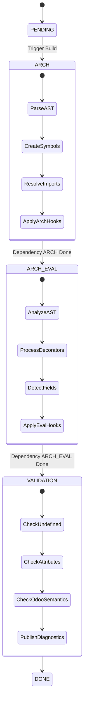

# Python Build Pipeline: ARCH → EVAL → VALIDATION

> **Scope**: Detailed reference for the three-phase build pipeline used by the Odoo Language Server to process Python files. This document covers the internal logic, data structures, hooks, and provides a concrete example of how code is processed.

## 1. Architecture Overview

The Odoo Language Server processes Python files in three sequential phases. This design allows for:
1.  **Incremental Compilation**: Only rebuild what is necessary.
2.  **Dependency Management**: Handle circular dependencies and import chains.
3.  **Odoo Specifics**: Inject framework magic (fields, environment) at the right time.



---

## 2. Phase 1: ARCH (Architecture)

**Goal**: Construct the **Symbol Tree** and establish **Dependencies**.  
**Builder**: `PythonArchBuilder` (`server/src/core/python_arch_builder.rs`)

In this phase, the server parses the code to understand *what* exists (classes, functions, variables) and *what it depends on* (imports), without caring about types or values.

### 2.1. Builder State & Strategy

The `PythonArchBuilder` maintains specific state to handle scoping and the deferred loading strategy.

#### `file_mode` (Deferred Loading)
The builder operates in two distinct modes, determined by the `file_mode` boolean:

1.  **File Mode (`true`)**: Building the module structure.
    *   **Scope**: Parses the entire file.
    *   **Action**: Creates symbols for top-level classes, functions, and variables.
    *   **Optimization**: It **skips function bodies**. Local variables inside methods are not added to the global symbol tree during this phase. This keeps the memory footprint low and the initial build fast.
2.  **Function Mode (`false`)**: Building a specific function body.
    *   **Scope**: Parses only the body of a specific function.
    *   **Trigger**: This is triggered on-demand, usually during the **VALIDATION** phase when the validator needs to check the internals of a function.
    *   **Action**: Populates the existing `FunctionSymbol` with local `VariableSymbol`s found in the body.

#### `sym_stack` (Scope Management)
The builder uses a stack of symbols (`Vec<Rc<RefCell<Symbol>>>`) to track the current scope during AST traversal.

*   **Initialization**: Starts with the `FileSymbol` (in file mode) or the `FunctionSymbol` (in function mode).
*   **Push**: When the visitor enters a `StmtClassDef` or `StmtFunctionDef`, the newly created symbol is pushed onto the stack.
*   **Pop**: When the visitor finishes the body of that definition, the symbol is popped.
*   **Usage**: New variables (assignments) are always added to the symbol currently at the top of the stack (`self.sym_stack.last()`).

### 2.2. The Visitor Pattern & AST Mapping

The builder implements a visitor pattern to traverse the AST generated by `ruff_python_parser`. It walks down the tree, converting AST nodes into Odoo LS `Symbol`s.

**AST to Symbol Conversion Examples**:

| Ruff AST Node | Builder Method | Action & Resulting Symbol |
|---------------|----------------|---------------------------|
| `StmtClassDef` | `visit_class_def` | Creates a `ClassSymbol`. Pushes it to `sym_stack`, visits the body, then pops it. |
| `StmtFunctionDef` | `visit_func_def` | Creates a `FunctionSymbol`. If `file_mode` is true, it **stops here** (skips body). If false, it visits the body. |
| `StmtAssign` (`x = 1`) | `visit_assign` | Extracts targets. Creates a `VariableSymbol` named `x` in the current scope. |
| `StmtAnnAssign` (`x: int = 1`) | `visit_ann_assign` | Creates a `VariableSymbol` named `x`. Records the annotation for later evaluation. |
| `ExprNamed` (`x := 1`) | `visit_named_expr` | (Walrus operator) Creates a `VariableSymbol` named `x` in the current scope. |
| `StmtImport` | `visit_import` | Resolves the import and creates `VariableSymbol`s for the imported names (e.g., `models`). |

### 2.3. Import Resolution Logic

**File**: `server/src/core/import_resolver.rs`

The `resolve_import_stmt` function is the engine for linking symbols across files. It handles absolute imports, relative imports, and Odoo's addon structure.

**Mechanism**:

1.  **Base Resolution (`resolve_from_stmt`)**:
    *   Determines the starting point.
    *   For relative imports (`from . import X`), it resolves the path relative to the current file.
    *   For absolute imports (`import odoo.models`), it identifies the root package.

2.  **Entry Point Search**:
    *   The resolver iterates through the configured **Entry Points** (e.g., Odoo Addons paths, Odoo Core, Python Stdlib).
    *   It checks if the requested module path exists within any of these roots.

3.  **Symbol Traversal (`_get_or_create_symbol`)**:
    *   It walks the directory structure corresponding to the import path.
    *   **On-Demand Loading**: If it encounters a file (e.g., `odoo/models.py`) that hasn't been processed yet, it triggers the **ARCH** build for that file immediately.
    *   It returns the `Symbol` corresponding to the requested module or object.

4.  **Dependency Recording**:
    *   If resolution is successful, a dependency is recorded in the `FileSymbol`.
    *   `CurrentFile.dependencies[ARCH][ARCH].add(TargetFile)`
    *   This ensures that if `TargetFile` is modified, `CurrentFile` will be invalidated and rebuilt.

### 2.4. ARCH Hooks (Structural Injection)

**File**: `server/src/core/python_arch_builder_hooks.rs`

Hooks in this phase inject **symbols** that don't exist in the source code but are present at runtime.

| Hook Target | Injected Symbol | Logic |
|-------------|-----------------|-------|
| `odoo.models.BaseModel` | `env` | Adds a `VariableSymbol` named `env` to the class. |
| `odoo.api.Environment` | `cr`, `uid`, `context` | Adds these variables to the `Environment` class. |
| `odoo.fields.*` | `__get__`, `__init__` | Adds these methods to field classes if missing, ensuring type inference works later. |
| `odoo.init` | `SUPERUSER_ID`, `_` | Injects global variables available in Odoo's namespace. |

**Code Snippet (Simplified Hook)**:
```rust
// python_arch_builder_hooks.rs
if symbol.name() == "BaseModel" {
    // Inject 'env' variable so subclasses can see 'self.env'
    symbol.borrow_mut().add_new_variable(session, "env", &range);
}
```

---

## 3. Phase 2: ARCH_EVAL (Evaluation)

**Goal**: **Infer Types** and **Process Odoo Semantics**.  
**Builder**: `PythonArchEval` (`server/src/core/python_arch_eval.rs`)

This phase runs after the symbol tree is built. It figures out what things *are*.

### 3.1. Process Breakdown

1.  **Prerequisite Check**: Ensures the ARCH phase is `DONE` for the current symbol and its dependencies.
2.  **AST Analysis**: Calls `Evaluation::analyze_ast` to infer types for expressions.
    *   `x = 1` → `x` gets type `int`.
    *   `y = x` → `y` gets type `int`.
3.  **Decorator Processing**:
    *   `@api.depends('foo')`: Infers that `foo` must be a field.
    *   `@api.model`: Marks the method as a model method (no `ids`).
4.  **Field Detection**:
    *   Assignments like `name = fields.Char()` are detected.
    *   The symbol is marked as a field, and added to the `ModelData` registry.

### 3.2. ARCH_EVAL Hooks (Type Injection)

**File**: `server/src/core/python_arch_eval_hooks.rs`

Hooks in this phase inject **type evaluations**. This is critical for Odoo's "magic" behavior.

| Hook Target | Type Injection | Explanation |
|-------------|----------------|-------------|
| `BaseModel.env` | `Environment` | Tells the system that `self.env` is an instance of `odoo.api.Environment`. |
| `BaseModel.ids` | `List[int]` | `self.ids` is a list of integers. |
| `fields.Char` | `__get__` → `str` | When `record.char_field` is accessed, it returns a `str`. |
| `fields.Many2one` | `__get__` → `Comodel` | When `record.m2o_field` is accessed, it returns an instance of the comodel. |

**Code Snippet (Simplified Hook)**:
```rust
// python_arch_eval_hooks.rs
// Hook for odoo.fields.Char
func: |...| {
    // Tell the system that __get__ returns a string
    PythonArchEvalHooks::_update_get_eval(..., "str");
}
```

---

## 4. Phase 3: VALIDATION

**Goal**: Generate **Diagnostics** (Errors/Warnings).  
**Validator**: `PythonValidator` (`server/src/core/python_validator.rs`)

This phase checks the validity of the code based on the symbols and types inferred in previous phases.

### 4.1. Process Breakdown

1.  **Scope Analysis**: Checks if variables used are defined in the current scope or parent scopes.
2.  **Attribute Checking**:
    *   For `obj.attr`, it looks up the type of `obj`.
    *   Checks if that type has a member named `attr`.
3.  **Odoo Specific Validation**:
    *   **Field Existence**: `record.field` checks if `field` is in `ModelData`.
    *   **XML IDs**: `self.env.ref('module.xml_id')` verifies the XML ID exists in the database/code.
    *   **Depends**: `@api.depends('a.b')` verifies that `a` is a field and `b` is a field on `a`'s comodel.

---

## 5. Deep Dive: Orchestration & State Management

The entire pipeline is driven by the `SyncOdoo` struct in `server/src/core/odoo.rs`. It maintains three queues corresponding to the build phases.

### 5.1. The Rebuild Loop (`process_rebuilds`)

The server runs a continuous loop (debounced) to process changes.

```rust
// Simplified logic from SyncOdoo::process_rebuilds
loop {
    // 1. ARCH Phase
    while let Some(symbol) = self.rebuild_arch.pop() {
        // Ensure dependencies are built (recursive)
        // Call PythonArchBuilder::load_arch(symbol)
        // Move to next queue
        self.add_to_rebuild_arch_eval(symbol);
    }

    // 2. ARCH_EVAL Phase
    while let Some(symbol) = self.rebuild_arch_eval.pop() {
        // Ensure dependencies (ARCH phase of imports) are DONE
        // Call PythonArchEval::eval_arch(symbol)
        // Move to next queue
        self.add_to_rebuild_validation(symbol);
    }

    // 3. VALIDATION Phase
    while let Some(symbol) = self.rebuild_validation.pop() {
        // Ensure dependencies (ARCH_EVAL phase of imports) are DONE
        // Call PythonValidator::validate(symbol)
    }
}
```

### 5.2. Dependency Management

Dependencies are tracked in a 2D array on `FileSymbol` (`server/src/core/symbols/file_symbol.rs`).

```rust
pub struct FileSymbol {
    // dependencies[my_step][dependency_level]
    // Example: dependencies[ARCH_EVAL][ARCH] contains files I need to have ARCH done
    // before I can do my ARCH_EVAL.
    pub dependencies: Vec<Vec<Option<PtrWeakHashSet<Weak<RefCell<Symbol>>>>>>,
}
```

**Invalidation Propagation**:
When a file changes (e.g., `models.py` is edited):
1.  `models.py` is marked `INVALID` for all phases.
2.  The server looks at `dependents` of `models.py`.
3.  If `utils.py` depends on `models.py`, `utils.py` is also marked `INVALID` and added to the rebuild queue.
4.  This ensures that if you change a function signature in `models.py`, `utils.py` will be re-validated to check for type errors.

---

## 6. Deep Dive: Type Inference (`analyze_ast`)

**File**: `server/src/core/evaluation.rs`

The core of the `ARCH_EVAL` phase is the `analyze_ast` function. It takes an AST expression and returns a list of possible `Evaluation`s.

### 6.1. Algorithm

```rust
pub fn analyze_ast(
    session: &mut SessionInfo,
    ast: &Expr,
    parent: Rc<RefCell<Symbol>>,
    ...
) -> (Vec<Evaluation>, Vec<Diagnostic>) {
    match ast {
        Expr::Name(name) => {
            // 1. Look up symbol in current scope (SymbolMgr)
            // 2. If found, return its stored evaluations
        },
        Expr::Attribute(attr) => {
            // 1. Recursively analyze the base object (attr.value)
            // 2. For each possible type of base:
            //    a. Look for member 'attr.attr'
            //    b. If member is a descriptor (has __get__), call hook
            //    c. Return member's type
        },
        Expr::Call(call) => {
            // 1. Analyze function being called
            // 2. Map arguments to parameters
            // 3. Return function's return type
        },
        // ... handle literals, binops, etc.
    }
}
```

### 6.2. Context Propagation

Type inference uses a `Context` map to handle complex scenarios like `self` in inheritance or Odoo domains.

*   `ContextValue::SELF`: When analyzing a method, `self` points to the class symbol.
*   `ContextValue::COMODEL`: When analyzing a relational field, this tracks the target model.

---

## 7. Concrete Example: The Lifecycle of a Symbol

Let's trace how the server processes a simple Odoo model and a method using it.

**File 1: `my_module/models.py`**
```python
from odoo import models, fields

class MyModel(models.Model):
    _name = 'my.model'
    name = fields.Char()
```

**File 2: `my_module/utils.py`**
```python
from .models import MyModel

def process_record(record):
    # record is typed as MyModel via annotation or inference
    print(record.name)
    print(record.env.user.name)
```

### Step 1: ARCH Phase (`models.py`)

1.  **Parse**: `class MyModel` detected.
2.  **Inheritance**: `models.Model` is resolved.
    *   `models` resolves to `odoo/models/__init__.py`.
    *   `Model` resolves to `BaseModel` in `odoo/models.py`.
3.  **Hook Trigger**: `MyModel` inherits `BaseModel`.
    *   **ARCH Hook**: `BaseModel` has `env` injected. `MyModel` inherits this symbol.
4.  **Symbol Tree**:
    ```text
    File(models.py)
    └── Class(MyModel)
        ├── Variable(_name)
        └── Variable(name)
    ```

### Step 2: ARCH_EVAL Phase (`models.py`)

1.  **Evaluate `name = fields.Char()`**:
    *   `fields.Char` resolves to `odoo.fields.Char`.
    *   **Hook**: `odoo.fields.Char` has a `__get__` method returning `str`.
2.  **Field Registration**: `name` is registered as a field of `my.model`.
3.  **Model Registration**: `my.model` is added to the global `Model` registry.

### Step 3: ARCH Phase (`utils.py`)

1.  **Import Resolution**: `from .models import MyModel`.
    *   Resolves to `File(models.py) -> Class(MyModel)`.
    *   **Dependency**: `utils.py` depends on `models.py`.
2.  **Symbol Tree**:
    ```text
    File(utils.py)
    ├── Variable(MyModel) (Import)
    └── Function(process_record)
        └── Variable(record) (Arg)
    ```

### Step 4: ARCH_EVAL Phase (`utils.py`)

1.  **Analyze `process_record`**:
    *   Assume `record` is inferred as `MyModel` (e.g., via docstring or call site).
2.  **Evaluate `record.name`**:
    *   `record` is `MyModel`.
    *   `MyModel` has `name`.
    *   `name` is `fields.Char`.
    *   **Hook**: `Char.__get__` returns `str`.
    *   Result: `record.name` is `str`.
3.  **Evaluate `record.env.user.name`**:
    *   `record.env`: `MyModel` inherits `env` from `BaseModel`.
        *   **Hook**: `BaseModel.env` is typed as `Environment`.
    *   `env.user`: `Environment` has `user`.
        *   **Hook**: `Environment.user` is typed as `res.users`.
    *   `user.name`: `res.users` (built-in model) has `name` field.
    *   Result: `str`.

### Step 5: VALIDATION Phase (`utils.py`)

1.  **Check `record.name`**:
    *   Does `MyModel` have `name`? **Yes**.
2.  **Check `record.env.user.name`**:
    *   Does `Environment` have `user`? **Yes**.
    *   Does `res.users` have `name`? **Yes**.
3.  **Result**: No diagnostics generated.

---

## 8. Source Code References

| Component | File | Key Functions |
|-----------|------|---------------|
| **Orchestrator** | `server/src/core/odoo.rs` | `process_rebuilds`, `SyncOdoo` struct |
| **ARCH Builder** | `server/src/core/python_arch_builder.rs` | `load_arch`, `visit_stmt_class_def` |
| **Import Resolver** | `server/src/core/import_resolver.rs` | `resolve_import_stmt` |
| **ARCH Hooks** | `server/src/core/python_arch_builder_hooks.rs` | `PythonArchBuilderHooks::on_class_def` |
| **EVAL Builder** | `server/src/core/python_arch_eval.rs` | `eval_arch`, `analyze_ast` |
| **EVAL Hooks** | `server/src/core/python_arch_eval_hooks.rs` | `PythonArchEvalHooks::handle_func_decorators` |
| **Validator** | `server/src/core/python_validator.rs` | `validate` |
| **File Symbol** | `server/src/core/symbols/file_symbol.rs` | `FileSymbol` struct, dependency storage |
