# Python Core Onboarding Guide - Odoo Language Server

> **Audience**: Developers new to the odoo-ls codebase who want to understand how Python support is implemented.  
> **Scope**: This guide focuses on the core symbol table/tree building, evaluation, and validation pipeline for Python files. XML and CSV support are covered separately.  
> **Prerequisites**: Basic understanding of Rust, LSP concepts, and the Odoo framework.

## Table of Contents

1. [Introduction](#1-introduction)
2. [Architecture Overview](#2-architecture-overview)
3. [Symbol System](#3-symbol-system)
4. [Build Pipeline](#4-build-pipeline)
5. [Model System (Odoo-Specific)](#5-model-system-odoo-specific)
6. [Evaluation & Type Inference](#6-evaluation--type-inference)
7. [Entry Points & File Management](#7-entry-points--file-management)
8. [Main Orchestration](#8-main-orchestration)
9. [Common Patterns & Idioms](#9-common-patterns--idioms)
10. [Troubleshooting & Debugging](#10-troubleshooting--debugging)
11. [References](#11-references)

---

## 1. Introduction

The Odoo Language Server (odoo-ls) is a Rust-based LSP implementation that provides IDE features specifically for Odoo framework development. This guide focuses on the **core Python support** - how the language server builds a symbol table, performs type inference, and validates code.

### What You'll Learn

- How symbols are organized in a hierarchical tree structure
- The three-phase build pipeline (ARCH → ARCH_EVAL → VALIDATION)
- How Odoo models are tracked and aggregated across multiple files
- How type inference works for Python expressions
- How dependencies between files trigger rebuilds
- Key patterns used throughout the codebase

### Key Design Principles

1. **Incremental Processing**: Only rebuild what changes, propagate through dependencies
2. **Shared Ownership**: `Rc<RefCell<Symbol>>` for shared mutable state, `Weak` references to prevent cycles
3. **Phased Building**: Separate parsing, evaluation, and validation for clear dependency management
4. **Odoo-Aware**: Special handling for models, fields, decorators, and XML IDs

---

## 2. Architecture Overview

### High-Level Components

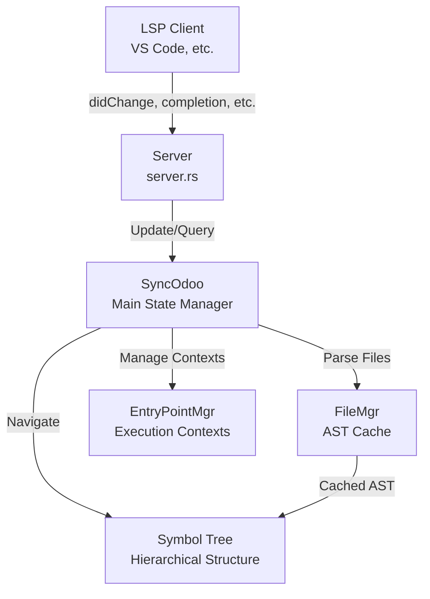

**Core Components**:
- **`server.rs`**: LSP message routing, handles requests/notifications
- **`core/odoo.rs`**: `SyncOdoo` struct - central state manager, initialization, rebuild orchestration
- **`core/file_mgr.rs`**: File content caching, AST parsing, diagnostic publishing
- **`core/entry_point.rs`**: Manages multiple Python execution contexts (Odoo core, addons, stdlib, etc.)
- **`core/symbols/`**: Symbol tree implementation (Root → Package → File → Class/Function/Variable)
- **`core/python_arch_builder.rs`**: ARCH phase - parse and build symbol tree
- **`core/python_arch_eval.rs`**: ARCH_EVAL phase - type evaluation
- **`core/python_validator.rs`**: VALIDATION phase - generate diagnostics
- **`core/evaluation.rs`**: Type inference algorithm
- **`core/model.rs`**: Odoo model tracking and aggregation

### Threading Model

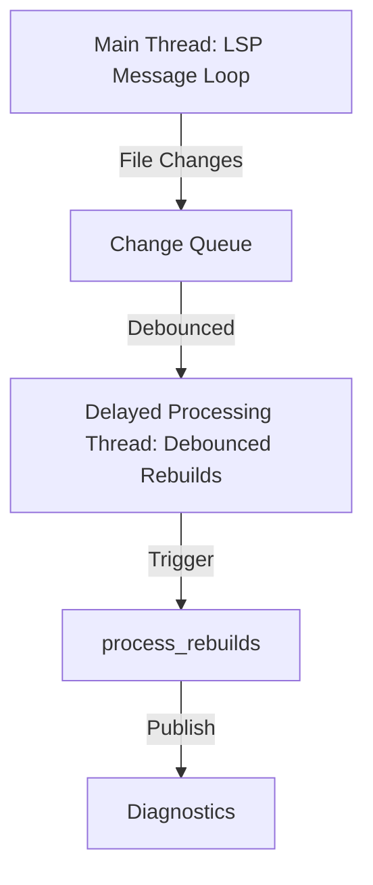

- **Main thread**: Handles LSP requests/responses via channels
- **Delayed processing thread**: Debounces file changes (avoid rebuilding on every keystroke)
- **Shared state**: `Arc<Mutex<SyncOdoo>>` for thread-safe access
- **Cancellation**: `interrupt_rebuild` and `terminate_rebuild` atomic flags

### Data Flow: File Change → Diagnostics

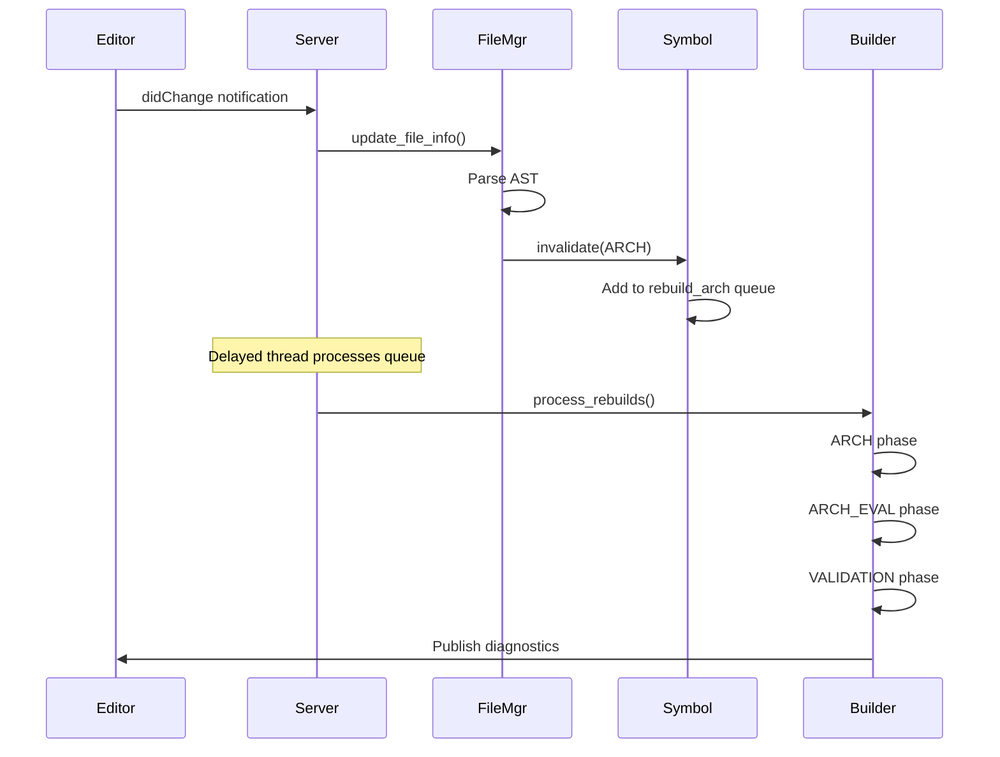

---

## 3. Symbol System

The symbol system organizes all code entities (files, classes, functions, variables) in a hierarchical tree structure.

### Symbol Hierarchy

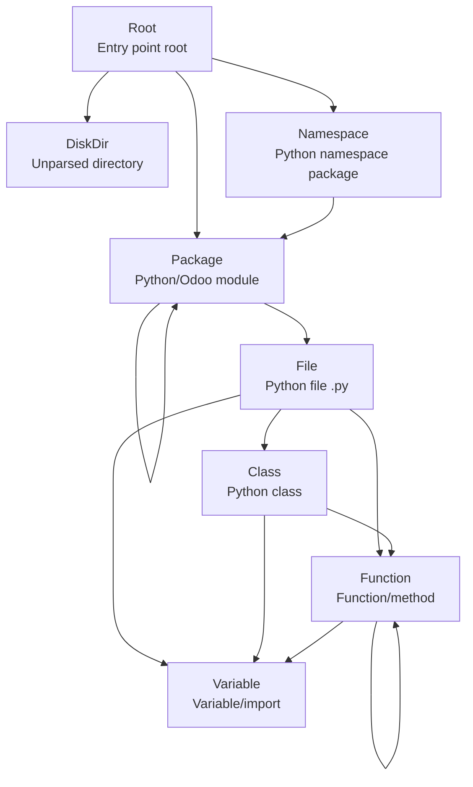

### Symbol Enum (`core/symbols/symbol.rs`)

The `Symbol` enum represents all symbol types:

```rust
pub enum Symbol {
    Root(RootSymbol),           // Entry point root
    DiskDir(DiskDirSymbol),     // Unparsed directory
    Namespace(NamespaceSymbol), // Python namespace package
    Package(PackageSymbol),     // Python package or Odoo module
    File(FileSymbol),           // Python .py file
    Compiled(CompiledSymbol),   // .pyc or stub .pyi
    Class(ClassSymbol),         // Python class
    Function(FunctionSymbol),   // Function or method
    Variable(VariableSymbol),   // Variable, import, parameter
    XmlFileSymbol(...),         // (Not covered here)
    CsvFileSymbol(...),         // (Not covered here)
}
```

**Key Symbol Types for Python**:

| Symbol Type | Purpose | File |
|-------------|---------|------|
| `Root` | Top-level container for an entry point | `root_symbol.rs` |
| `Package` | Python package (`__init__.py`) or Odoo module (`__manifest__.py`) | `package_symbol.rs` |
| `File` | Python source file | `file_symbol.rs` |
| `Class` | Python class definition | `class_symbol.rs` |
| `Function` | Function or method | `function_symbol.rs` |
| `Variable` | Variable, import, or parameter | `variable_symbol.rs` |

### Ownership Pattern: Rc and Weak References

Symbols use **reference counting** to manage ownership and prevent memory leaks from cycles:

```rust
// Symbol is wrapped in Rc<RefCell<_>> for shared ownership with interior mutability
let symbol: Rc<RefCell<Symbol>> = Rc::new(RefCell::new(Symbol::File(...)));

// Each symbol holds a weak reference to itself for creating weak pointers
symbol.borrow_mut().set_weak_self(Rc::downgrade(&symbol));

// Parent is a weak reference to prevent ownership cycles
symbol.borrow_mut().set_parent(Some(parent_weak));
```

**Why this pattern?**
- **`Rc<RefCell<Symbol>>`**: Multiple parts of the code need to access and modify the same symbol
- **Weak parent references**: Child → Parent would create a cycle if using `Rc`
- **Weak dependencies**: Symbol dependencies use weak references to allow garbage collection

### BuildStatus Tracking

Each symbol tracks its build status for each phase independently:

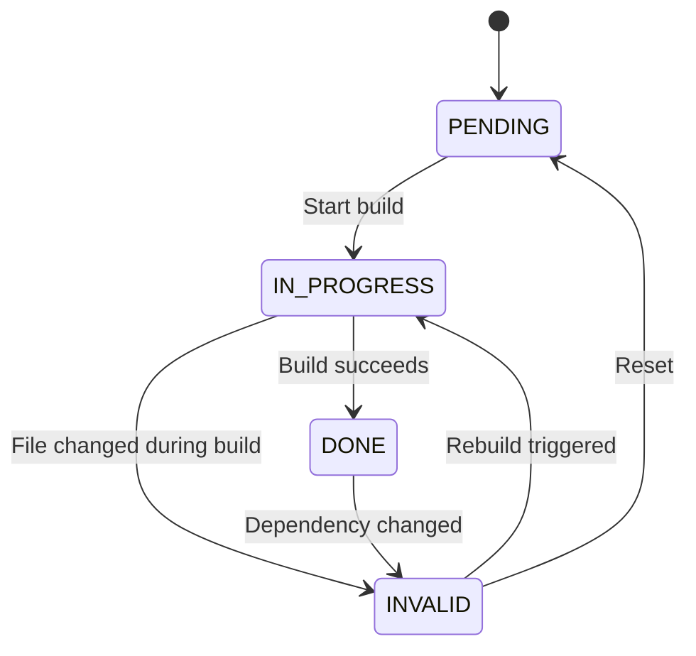

**BuildSteps enum** (`constants.rs:89-94`):
```rust
pub enum BuildSteps {
    SYNTAX     = -1,  // Parse errors (not a build step)
    ARCH       = 0,   // Architecture: symbol tree, imports
    ARCH_EVAL  = 1,   // Evaluation: type inference
    VALIDATION = 2,   // Validation: diagnostics
}
```

**BuildStatus enum** (`constants.rs:105-110`):
```rust
pub enum BuildStatus {
    PENDING,      // Not built yet
    IN_PROGRESS,  // Currently building
    INVALID,      // Needs rebuild (dependency changed)
    DONE,         // Successfully built
}
```

**Example**: `FileSymbol` has three status fields:
```rust
pub struct FileSymbol {
    pub arch_status: BuildStatus,       // ARCH phase status
    pub arch_eval_status: BuildStatus,  // ARCH_EVAL phase status
    pub validation_status: BuildStatus, // VALIDATION phase status
    // ... other fields
}
```

### Key Symbol Files

#### FileSymbol (`core/symbols/file_symbol.rs:7-37`)

Represents a Python source file. Tracks dependencies and build status.

```rust
pub struct FileSymbol {
    pub name: OYarn,
    pub path: String,
    pub arch_status: BuildStatus,
    pub arch_eval_status: BuildStatus,
    pub validation_status: BuildStatus,
    
    // Dependency tracking (2D arrays: [step][level])
    pub dependencies: Vec<Vec<Option<PtrWeakHashSet<Weak<RefCell<Symbol>>>>>>,
    pub dependents: Vec<Vec<Option<PtrWeakHashSet<Weak<RefCell<Symbol>>>>>>,
    
    // Track unresolved imports/models for later resolution
    pub not_found_paths: Vec<(BuildSteps, Vec<OYarn>)>,
    pub not_found_models: HashMap<OYarn, BuildSteps>,
    
    // Symbols defined in this file (from SymbolMgr trait)
    pub symbols: HashMap<OYarn, HashMap<u32, Vec<Rc<RefCell<Symbol>>>>>,
    // ...
}
```

#### ClassSymbol (`core/symbols/class_symbol.rs:17-37`)

Represents a Python class, potentially an Odoo model.

```rust
pub struct ClassSymbol {
    pub name: OYarn,
    pub range: TextRange,
    pub body_range: TextRange,  // Excludes class definition line
    pub bases: Vec<Weak<RefCell<Symbol>>>,  // Base classes
    pub _model: Option<ModelData>,  // Odoo model metadata if applicable
    
    // Symbols defined in class body (from SymbolMgr trait)
    pub symbols: HashMap<OYarn, HashMap<u32, Vec<Rc<RefCell<Symbol>>>>>,
    // ...
}
```

**ModelData** contains Odoo-specific metadata:
```rust
pub struct ModelData {
    pub name: OYarn,              // _name
    pub inherit: Vec<OYarn>,      // _inherit
    pub inherits: Vec<(OYarn, OYarn)>,  // _inherits: (model, field)
    pub computes: HashMap<OYarn, HashSet<OYarn>>,  // function → fields
    // ...
}
```

#### FunctionSymbol (`core/symbols/function_symbol.rs:31-64`)

Represents a function or method with its own build status and return type tracking.

```rust
pub struct FunctionSymbol {
    pub name: OYarn,
    pub range: TextRange,
    pub body_range: TextRange,
    pub args: Vec<Argument>,  // Function parameters
    pub evaluations: Vec<Evaluation>,  // Inferred return types
    
    // Function-level build status
    pub arch_status: BuildStatus,
    pub arch_eval_status: BuildStatus,
    pub validation_status: BuildStatus,
    
    // Decorator flags
    pub is_static: bool,
    pub is_property: bool,
    pub is_class_method: bool,
    // ...
}
```

#### VariableSymbol (`core/symbols/variable_symbol.rs:8-20`)

Represents variables, imports, and parameters.

```rust
pub struct VariableSymbol {
    pub name: OYarn,
    pub range: TextRange,
    pub evaluations: Vec<Evaluation>,  // Inferred types (can be multiple)
    pub is_import_variable: bool,  // Created from import statement
    pub is_parameter: bool,        // Function parameter
    // ...
}
```

### SymbolMgr Trait: Section-Based Visibility

The `SymbolMgr` trait (`core/symbols/symbol_mgr.rs`) manages symbols within a scope (file, class, function) with **section-based visibility** to handle control flow.

**Key concept**: Control flow (if/elif/else, try/except) creates different visibility sections.

```python
# Section 0 (before if)
x = 1

if condition:
    # Section 1 (if body)
    y = 2
elif other:
    # Section 2 (elif condition evaluated)
    # Section 3 (elif body)
    y = 3
else:
    # Section 4 (else body)
    y = 4

# Section 5 (after if) - can see x, and y from sections 1, 3, or 4
```

Each section tracks:
- `start`: Position where section begins
- `index`: Unique section identifier
- `previous_indexes`: Parent section(s) - can be `INDEX(n)` or `OR([n, m, ...])`

**Methods**:
- `get_content_symbol(name, position)`: Find symbol visible at position
- `add_section(range_start, previous)`: Create new section
- `change_parent(new_parent, section)`: Rewire section dependencies (for if/else)

---

## 4. Build Pipeline

> **Deep Dive**: For a detailed explanation of the pipeline, including hooks and examples, see [Python Build Pipeline](python-build-pipeline.md).

The build pipeline consists of three phases that run sequentially for each symbol. Each phase depends on the previous phase being complete.

### Three-Phase Overview

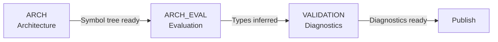

| Phase | Purpose | Main Builder | Key Actions |
|-------|---------|--------------|-------------|
| **ARCH** | Build symbol tree | `PythonArchBuilder` | Parse AST, create symbols, resolve imports, establish dependencies |
| **ARCH_EVAL** | Type evaluation | `PythonArchEval` | Infer types, process decorators, detect Odoo fields |
| **VALIDATION** | Generate diagnostics | `PythonValidator` | Validate names, attributes, types, Odoo patterns |

### Build Flow Sequence Diagram

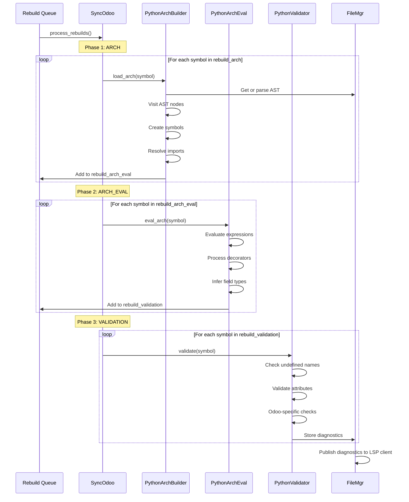

### Phase 1: ARCH (Architecture)

**File**: `core/python_arch_builder.rs`  
**Entry point**: `PythonArchBuilder::load_arch()` (lines 60-100)  
**Runs on**: File symbols and Package symbols

**Purpose**: Parse the Python file and build the initial symbol tree.

**Key Actions**:
1. **Parse AST**: Get parsed AST from `FileMgr` (cached if available)
2. **Visit statements**: Traverse AST and create symbols
   - `visit_stmt_class_def()`: Create `ClassSymbol`
   - `visit_stmt_function_def()`: Create `FunctionSymbol`
   - `visit_stmt_assign()`: Create `VariableSymbol` for assignments
   - `visit_stmt_import()` / `visit_stmt_import_from()`: Create import variables
3. **Resolve imports**: Use `resolve_import_stmt()` to find imported symbols
4. **Track dependencies**: Add file→file dependencies for imports
5. **Handle control flow**: Create sections for if/elif/else, try/except, loops

**Example: Creating a function symbol**
```rust
fn visit_stmt_function_def(&mut self, stmt: &StmtFunctionDef, session: &mut SessionInfo) {
    let parent = self.sym_stack.last().unwrap();
    let function = parent.borrow_mut().add_new_function(
        session, 
        &stmt.name.to_string(),
        stmt.range(),
        stmt.body[0].start()  // Body starts after def line
    );
    function.borrow_mut().set_node_index(stmt);  // Link to AST node
    
    // Enter function scope
    self.sym_stack.push(function.clone());
    // ... visit function body ...
    self.sym_stack.pop();
}
```

**Deferred Method Body Evaluation**:
For class methods, the body is **skipped** during the initial file ARCH build.
- **Why?** Local variables in methods are not part of the module's public interface and shouldn't pollute the global symbol tree. Skipping them improves performance.
- **When are they built?** Method bodies are processed when `load_arch` is called specifically on the function symbol (e.g., during validation or when the function is actively edited).

**Import Resolution** (`core/import_resolver.rs`):
- Iterates through entry points in resolution order (addons → main → builtins → public)
- Navigates symbol tree to find resolved modules/symbols
- Creates dependency: importing file → imported file
- Stores `Evaluation` on import variable pointing to imported symbol

### Phase 2: ARCH_EVAL (Architecture Evaluation)

**File**: `core/python_arch_eval.rs`  
**Entry point**: `PythonArchEval::eval_arch()` (lines 55-100)  
**Runs on**: File symbols and Function symbols

**Purpose**: Evaluate expressions and infer types.

**Key Actions**:
1. **Prerequisite check**: Verify ARCH phase is DONE
2. **Visit assignments**: Call `Evaluation::analyze_ast()` on right-hand side
3. **Store type information**: Save `Evaluation` results on variable symbols
4. **Process decorators**: Call hooks for Odoo-specific patterns
   - `@api.depends('field')` → infer that `field` exists
   - `@api.model` → function returns model instance
   - Field descriptors → infer field types
5. **Handle annotations**: Process type hints (informational, may validate later)

**Hooks System** (`core/python_arch_eval_hooks.rs`):

Hooks are triggered after file/function evaluation to inject Odoo-specific knowledge. They exist for both ARCH (structure) and ARCH_EVAL (type inference) phases.

Example hook: Inject `env` variable type in Odoo 18.1+
```rust
PythonArchEvalFileHook {
    odoo_entry: true,  // Only for Odoo core files
    trees: vec![(Sy!("0.0"), Sy!("18.1"), ...)],  // Version range
    if_exist_only: true,  // Only if tree path exists
    func: |session, entry, file_symbol, symbol| {
        // Inject: env is of type Environment
        // This makes `self.env` resolve correctly in Odoo 18.1+ files
        let env_class = session.sync_odoo.get_symbol(..., vec!["Environment"]);
        symbol.borrow_mut().set_evaluations(vec![Evaluation { ... }]);
    }
}
```

**Field Detection**:
- Assignments like `field_name = fields.Char()` → create field
- Decorator references like `@api.depends('field_name')` → infer field exists
- Store in `ModelData.computes`: map function name → computed fields

### Phase 3: VALIDATION

**File**: `core/python_validator.rs`  
**Entry point**: `PythonValidator::validate()` (lines 77-110)  
**Runs on**: File symbols

**Purpose**: Generate diagnostics (errors, warnings) for the file.

**Key Checks**:
1. **Undefined names**: Variable used before definition
2. **Undefined attributes**: Accessing non-existent member
3. **Type mismatches**: Basic type checking (limited)
4. **Odoo-specific**:
   - Model field existence: `record.unknown_field`
   - Decorator compatibility: `@api.depends` on valid fields
   - XML ID validity: `self.env.ref('module.xml_id')`

**Diagnostic Storage**:
- File-level diagnostics → stored in `FileInfo.diagnostics[BuildSteps]`
- Function-level diagnostics → stored in `FunctionSymbol.diagnostics[BuildSteps]`
- Published to LSP client via `FileMgr::publish_diagnostics()`

### Dependency Tracking

Symbols track dependencies in a **2D array**: `dependencies[step][level]`

- **step**: Build step that depends (ARCH=0, ARCH_EVAL=1, VALIDATION=2)
- **level**: Build step required from dependency (ARCH=0, ARCH_EVAL=1)

**Example**: File A imports module B
```rust
// File A's ARCH_EVAL step needs File B's ARCH step to be done
file_a.add_dependency(
    &mut file_b,
    BuildSteps::ARCH_EVAL,  // My step that needs dependency
    BuildSteps::ARCH         // Level of dependency required
);
```

**Rebuild propagation**:
1. File B changes → `invalidate(file_b, ARCH)`
2. Mark B's ARCH, ARCH_EVAL, VALIDATION as INVALID
3. Find all dependents of B at ARCH level → includes A's ARCH_EVAL
4. Mark A's ARCH_EVAL and VALIDATION as INVALID
5. Add to rebuild queues

---

## 5. Model System (Odoo-Specific)

The model system tracks Odoo models across multiple files and modules.

### Model Structure

**File**: `core/model.rs`

```rust
pub struct Model {
    name: OYarn,  // Model's _name (e.g., "res.partner")
    symbols: PtrWeakHashSet<Weak<RefCell<Symbol>>>,  // All class symbols
    dependents: PtrWeakHashSet<Weak<RefCell<Symbol>>>,  // Files using this model
}

pub struct ModelData {
    pub name: OYarn,              // _name
    pub inherit: Vec<OYarn>,      // _inherit (extend models)
    pub inherits: Vec<(OYarn, OYarn)>,  // _inherits: (model, field_name)
    pub computes: HashMap<OYarn, HashSet<OYarn>>,  // func → computed fields
    // ... other Odoo metadata
}
```

**Key Concepts**:
- One `Model` per unique `_name` in the system (e.g., "res.partner")
- Multiple `ClassSymbol`s can belong to same `Model` (extensions from different modules)
- Each `ClassSymbol` has optional `ModelData` if it's an Odoo model

### Model Aggregation

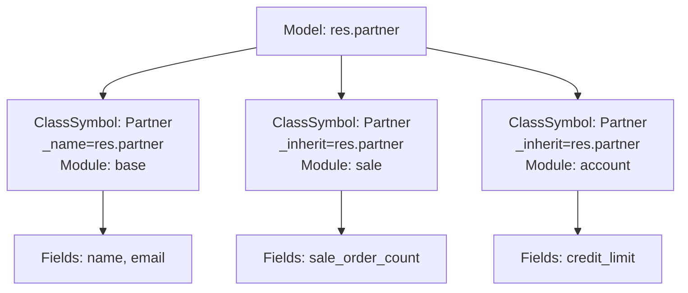

**Registration** (`core/python_odoo_builder.rs`):
1. During ARCH_EVAL, detect if class inherits from `models.Model`
2. Extract `_name` or inherit from `_inherit`
3. Create or get `Model` from `SyncOdoo.models` registry
4. Add `ClassSymbol` to `Model.symbols`

**Usage**:
```rust
// Get all classes that define/extend "res.partner"
let model = session.sync_odoo.models.get(&oyarn!("res.partner"))?;
let symbols = model.borrow().get_symbols(session, from_module);

// Get only main definitions (where _name == _inherit is false)
let main_symbols = model.borrow().get_main_symbols(session, from_module);
```

### Model Inheritance Patterns

#### `_name`: Define New Model

```python
class Partner(models.Model):
    _name = 'res.partner'
    name = fields.Char()
```

Creates a new model. The class is the **main symbol** for this model.

#### `_inherit`: Extend Existing Model

```python
class Partner(models.Model):
    _inherit = 'res.partner'
    sale_order_count = fields.Integer()
```

Extends `res.partner` **in-place**. All instances of `res.partner` will have `sale_order_count`.

**Multiple inheritance**:
```python
class Partner(models.Model):
    _inherit = ['res.partner', 'mail.thread']
```

#### `_inherits`: Delegation Inheritance

```python
class User(models.Model):
    _name = 'res.users'
    _inherits = {'res.partner': 'partner_id'}
    partner_id = fields.Many2one('res.partner', required=True)
```

Delegates attribute access: `user.name` → `user.partner_id.name`

### Field Detection

Fields are detected in multiple ways:

1. **Direct assignment**: `field_name = fields.Char()`
2. **Decorator usage**: `@api.depends('field_name')` implies field exists
3. **Relation metadata**: `Many2one('other.model', ...)` tracks comodel

**Processing** (`core/python_odoo_builder.rs`):
```rust
// Iterate class members
for (name, symbols) in class.borrow().get_symbols().iter() {
    for symbol in symbols.values().flatten() {
        if is_field_definition(symbol) {
            // Extract field type, string, compute, etc.
            model_data.computes.entry(compute_func).insert(field_name);
        }
    }
}
```

---

## 6. Evaluation & Type Inference

Type inference determines the type of Python expressions.

### Core Types

**File**: `core/evaluation.rs`

```rust
pub struct Evaluation {
    pub symbol: EvaluationSymbol,      // Type symbol (e.g., points to `str` class)
    pub value: Option<EvaluationValue>, // Literal value if constant
    pub range: Option<TextRange>,       // Source location
}

pub enum EvaluationSymbolPtr {
    WEAK(EvaluationSymbolWeak),  // Reference to type symbol
    SELF,                         // The 'self' parameter
    ARG(u32),                     // Function argument by index
    DOMAIN,                       // Odoo domain expression
    NONE,                         // None literal
    UNBOUND(OYarn),              // Unresolved name
    ANY,                          // Unknown type
}

pub enum EvaluationValue {
    ANY(),                    // Unknown value
    CONSTANT(Expr),           // Literal like 5, "hello"
    DICT(Vec<(Expr, Expr)>), // Dictionary literal
    LIST(Vec<Expr>),          // List literal
    TUPLE(Vec<Expr>),         // Tuple literal
}
```

### Type Inference Flow

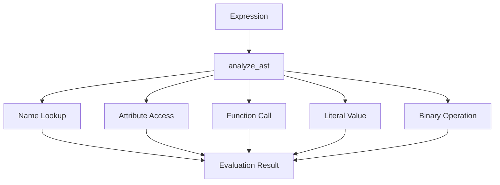

### The `analyze_ast()` Algorithm

**Signature** (`evaluation.rs` ~line 650):
```rust
pub fn analyze_ast(
    session: &mut SessionInfo,
    ast: &ExprOrIdent,                    // Expression to evaluate
    parent: Rc<RefCell<Symbol>>,          // Current scope
    max_infer: &TextSize,                 // Don't infer past this position
    context: &mut Option<Context>,        // Extra metadata
    for_annotation: bool,                 // Type annotation context
    required_dependencies: &mut Vec<Vec<Rc<RefCell<Symbol>>>>
) -> AnalyzeAstResult {
    // Returns: Vec<Evaluation> and Vec<Diagnostic>
}
```

**Processing by Expression Type**:

#### Name Expression
```python
x  # Look up 'x' in current scope
```
1. Call `parent.get_content_symbol("x", position)`
2. Follow import chains if it's an import variable
3. Return evaluation from variable's `evaluations` field

#### Attribute Expression
```python
obj.attr  # Access member 'attr' on 'obj'
```
1. `analyze_ast(obj)` → get object type
2. `get_member_symbol(obj_type, "attr")` → find attribute
3. Call `__get__` hooks for descriptors (Odoo fields)
4. Return attribute's evaluation

**Field Descriptor Example**:
```python
record.field_name  # where record is of type 'res.partner'
```
1. Infer `record` → `res.partner` class
2. Look up `field_name` → finds `fields.Char` class
3. `fields.Char` has `__get__` hook that returns `str` type

#### Call Expression
```python
func(arg1, arg2)
```
1. `analyze_ast(func)` → get function symbol
2. Extract return type from `function.evaluations`
3. Special case: `fields.Char()` → return `fields.Char` class (the descriptor)

#### Literal Expression
```python
5, "hello", [1, 2, 3]
```
- Number → `int`, `float`, or `complex`
- String → `str`
- List/Dict/Tuple → recursive evaluation of elements

#### Binary Operation
```python
a + b
```
1. Infer types of `a` and `b`
2. Apply operator rules: `int + int → int`, `str + str → str`
3. Fall back to `ANY` if ambiguous

### Context System

The `Context` type is a `HashMap<String, ContextValue>` that carries metadata through the evaluation:

| Context Key | Purpose |
|-------------|---------|
| `"MODULE"` | Current module for relative imports |
| `"base_attr"` | Base object for attribute access (`obj` in `obj.attr`) |
| `"self_sym"` | Object method is called on (for inheritance lookups) |
| `"comodel_name"` | Target model for relational fields |
| `"arguments"` | Call arguments for parameter matching |

**Example**: Evaluating `self.env['res.partner'].search([])`
1. `self` → context includes `"self_sym"` with class symbol
2. `.env` → attribute access, context includes `"base_attr"` = self
3. `env['res.partner']` → returns model class, context includes `"comodel_name"` = "res.partner"
4. `.search([])` → knows return type is recordset of `res.partner`

### Symbol Resolution: `follow_ref()`

**Purpose**: Dereference an evaluation to its final symbol(s).

**Process**:
1. Resolve `WEAK` pointers by upgrading weak references
2. Follow import chains (`is_import_variable` → follow to imported symbol)
3. Call `__get__` hooks for descriptors (objects that control attribute access, like Odoo fields)
4. Handle `SELF` and `ARG` special cases

**Returns**: `Vec<EvaluationSymbol>` (can be multiple for union types or ambiguous control flow results)

---

## 7. Entry Points & File Management

### Entry Point System

**File**: `core/entry_point.rs`

An **Entry Point** represents a Python execution context - a root directory where Python can import from.

```rust
pub struct EntryPoint {
    pub path: String,                    // Filesystem path
    pub tree: Vec<OYarn>,                // Path components for symbol lookup
    pub entry_type: EntryPointType,      // ODOO, ADDON, BUILTIN, etc.
    pub root: Rc<RefCell<Symbol>>,       // Root symbol for this entry
    // ...
}

pub enum EntryPointType {
    MAIN,      // Main workspace folder or Odoo core path
    ADDON,     // Addon path (from odoo.conf or auto-detected)
    BUILTIN,   // Python stdlib, typeshed
    PUBLIC,    // sys.path entries
    CUSTOM,    // User-opened files outside workspace
    UNTITLED,  // In-memory unsaved files
}
```

**Entry Point Concepts**:
- **Root**: The filesystem root (`/`). All entry points are children of the root symbol.
- **Main**: The primary project directory. If working on Odoo, this is the `odoo/` directory.
- **Addons**: Directories containing Odoo modules. They share the same root namespace as Main for resolution.

### Entry Point Manager

```rust
pub struct EntryPointMgr {
    pub builtins_entry_points: Vec<Rc<RefCell<EntryPoint>>>,
    pub public_entry_points: Vec<Rc<RefCell<EntryPoint>>>,
    pub main_entry_point: Option<Rc<RefCell<EntryPoint>>>,
    pub addons_entry_points: Vec<Rc<RefCell<EntryPoint>>>,
    pub custom_entry_points: Vec<Rc<RefCell<EntryPoint>>>,
    pub untitled_entry_points: Vec<Rc<RefCell<EntryPoint>>>,
}
```

**Setup during initialization** (`SyncOdoo::initialize`):
1. Create builtin entries: typeshed, stdlib, additional_stubs
2. Create main entry: Odoo core path (if configured)
3. Create addon entries: Each addon path (configured or detected)
4. Create public entries: Paths from Python's `sys.path`

### Import Resolution Order

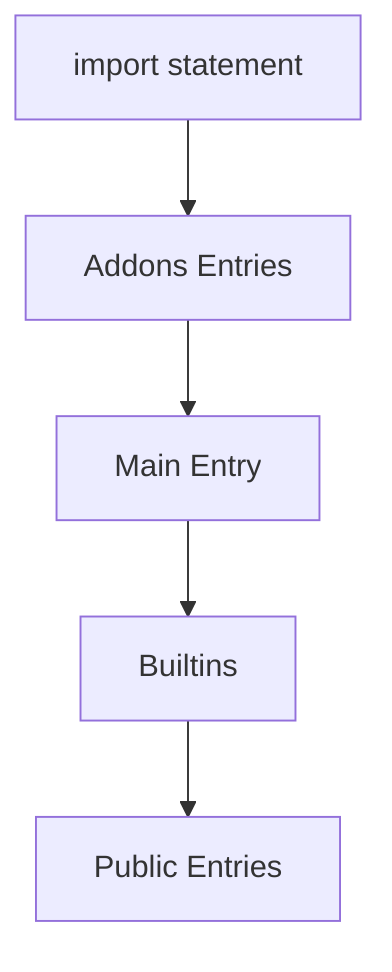

**Algorithm** (`entry_point.rs::iter_for_import`):
```rust
fn iter_for_import(&self, current_entry: &EntryPoint) 
    -> Box<dyn Iterator<Item = &EntryPoint>> 
{
    if is_main_or_addon {
        // Addons → Main → Builtins → Public
        Box::new(addons.chain(main).chain(builtins).chain(public))
    } else {
        // Custom/Untitled → Builtins → Public
        Box::new(custom.chain(builtins).chain(public))
    }
}
```

**Example**: Resolving `import odoo.models`
1. Try addons entries: Look for `odoo/models/` directory
2. Try main entry: Found! Navigate to `odoo/models/__init__.py`
3. Return symbol for `models` package

### File Management

**File**: `core/file_mgr.rs`

```rust
pub struct FileMgr {
    file_infos: HashMap<String, Rc<RefCell<FileInfo>>>,  // path → FileInfo
}

pub struct FileInfo {
    pub uri: String,                        // File URI
    pub version: Option<i32>,               // LSP version number
    pub opened: bool,                       // Opened in editor
    pub file_info_ast: Rc<RefCell<FileInfoAst>>,
    diagnostics: HashMap<BuildSteps, Vec<Diagnostic>>,
    // ...
}

pub struct FileInfoAst {
    pub text_hash: u64,                     // Hash for change detection
    pub text_document: Option<TextDocument>, // In-memory content
    pub indexed_module: Option<Arc<IndexedModule>>, // Parsed AST with index
    pub ast_type: AstType,                  // Python/Xml/Csv
}
```

**Key Methods**:

- **`update_file_info(path, content, version, is_external)`**: Load or update file
  - Applies incremental changes from LSP `didChange`
  - Parses AST with ruff
  - Creates `IndexedModule` for O(1) AST node lookup by `NodeIndex` (ruff-specific index)
  - Returns `(updated: bool, FileInfo)`

- **`get_file_info(path)`**: Retrieve cached file info

- **`publish_diagnostics(path)`**: Send diagnostics to LSP client

**AST Parsing**:
- Uses `ruff_python_parser` to parse Python source
- Creates `IndexedModule`: Maps `NodeIndex` → AST node for fast lookup
- Extracts tokens for `# noqa` comments and test directives
- Detects syntax errors → published as SYNTAX diagnostics

**TextDocument**: Tracks in-memory editor state
- Stores full text content
- Applies incremental changes (line/column-based edits)
- Version tracking for synchronization with editor

---

## 8. Main Orchestration

**File**: `core/odoo.rs`

### SyncOdoo Structure

The `SyncOdoo` struct is the **central state manager** for the language server.

```rust
pub struct SyncOdoo {
    // Version info
    pub version_major: u32,
    pub version_minor: u32,
    pub full_version: String,
    pub python_version: Vec<u32>,
    
    // Configuration
    pub config: ConfigEntry,
    pub config_file: Option<ConfigFile>,
    
    // Symbol management
    pub entry_point_mgr: Rc<RefCell<EntryPointMgr>>,
    pub modules: HashMap<OYarn, Weak<RefCell<Symbol>>>,  // Odoo module name → symbol
    pub models: HashMap<OYarn, Rc<RefCell<Model>>>,      // Model _name → Model
    
    // File management
    file_mgr: Rc<RefCell<FileMgr>>,
    
    // Build queues
    rebuild_arch: PtrWeakHashSet<Weak<RefCell<Symbol>>>,
    rebuild_arch_eval: PtrWeakHashSet<Weak<RefCell<Symbol>>>,
    rebuild_validation: PtrWeakHashSet<Weak<RefCell<Symbol>>>,
    
    // Cancellation
    pub interrupt_rebuild: Arc<AtomicBool>,
    pub terminate_rebuild: Arc<AtomicBool>,
    
    // State
    pub state_init: InitState,  // NOT_READY / PYTHON_READY / ODOO_READY
    pub need_rebuild: bool,
    pub opened_files: Vec<String>,
    
    // LSP
    pub capabilities: ClientCapabilities,
    pub encoding: PositionEncoding,
    // ...
}
```

### Initialization Flow

**Method**: `SyncOdoo::initialize()` and `SyncOdoo::load_odoo()`

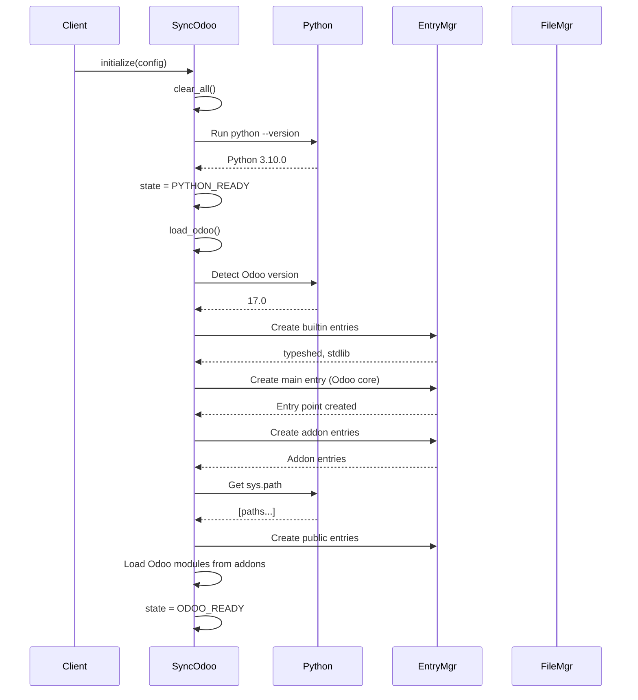

**Steps**:
1. **Clear state**: Reset all symbols, file cache, models
2. **Validate Python**: Run `python --version` to verify interpreter
3. **Detect Odoo version**: Parse `odoo/release.py` or `odoo/__manifest__.py`
4. **Create entry points**:
   - Builtins: typeshed, stdlib from Python installation
   - Main: Odoo core path (from `config.odoo_path`)
   - Addons: Each path in `config.addons_paths`
   - Public: Paths from running `python -c "import sys; print(sys.path)"`
5. **Load Odoo modules**: Scan addon directories for `__manifest__.py` files
6. **Set state**: `ODOO_READY`

### Symbol Lookup: `get_symbol()`

// TODO: this is ok, but a bit out of place. The section before and the one after should not have this in between.

**Signature**:
```rust
pub fn get_symbol(
    &mut self,
    path: &str,             // Starting file path (or "" for all entries)
    tree: &Tree,            // (file_path, content_path)
    position: u32           // Max position for visibility
) -> Vec<Rc<RefCell<Symbol>>>
```

**Tree structure**:
- `tree.0`: File path components: `vec!["odoo", "models"]` → navigate to `odoo/models/__init__.py`
- `tree.1`: Content path components: `vec!["BaseModel", "env"]` → find `env` member of `BaseModel` class

**Algorithm**:
1. Find entry point matching `path` (or iterate all if `path == ""`)
2. Navigate file tree: Follow `tree.0` components through symbol hierarchy
3. Navigate content tree: Follow `tree.1` components through symbol members
4. Apply visibility rules based on `position`
5. Return all matching symbols (can be multiple)

**Example**:
```rust
// Find odoo.models.BaseModel.env
let symbols = session.sync_odoo.get_symbol(
    "/path/to/odoo",
    &(vec![Sy!("odoo"), Sy!("models")], vec![Sy!("BaseModel"), Sy!("env")]),
    u32::MAX
);
```

### Rebuild Queue Processing

**Method**: `SyncOdoo::process_rebuilds()`

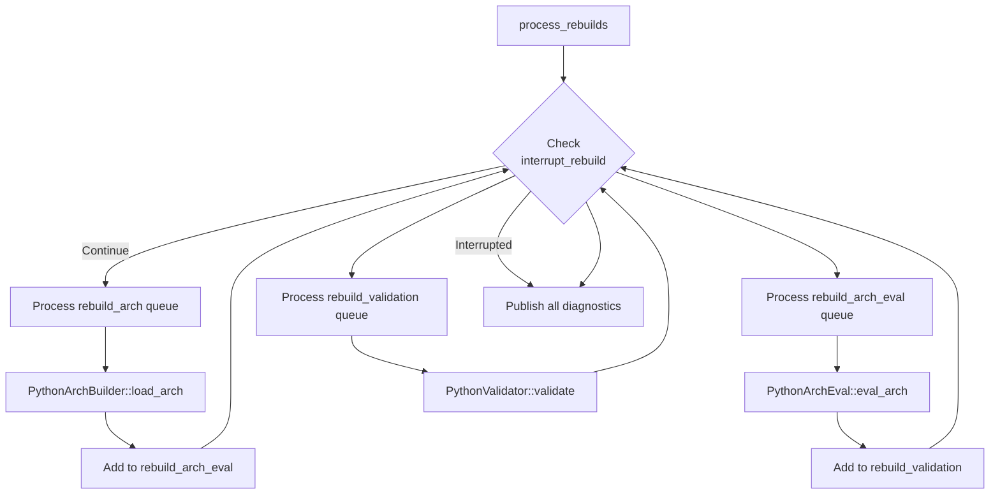

**Algorithm**:
1. **Build ARCH queue**: While `rebuild_arch` not empty
   - Take one symbol from queue
   - Build dependencies first (recursive)
   - Call `PythonArchBuilder::load_arch(symbol)`
   - Add to `rebuild_arch_eval` queue
   - Check cancellation

2. **Build ARCH_EVAL queue**: While `rebuild_arch_eval` not empty
   - Take one symbol
   - Build dependencies
   - Call `PythonArchEval::eval_arch(symbol)`
   - Add to `rebuild_validation` queue
   - Check cancellation

3. **Build VALIDATION queue**: While `rebuild_validation` not empty
   - Take one symbol
   - Build dependencies
   - Call `PythonValidator::validate(symbol)`
   - Check cancellation

4. **Publish diagnostics**: For all modified files

### Dependency Invalidation

**Method**: `Symbol::invalidate(symbol, step)`

**Purpose**: Mark a symbol and all its dependents as needing rebuild.

**Algorithm**:
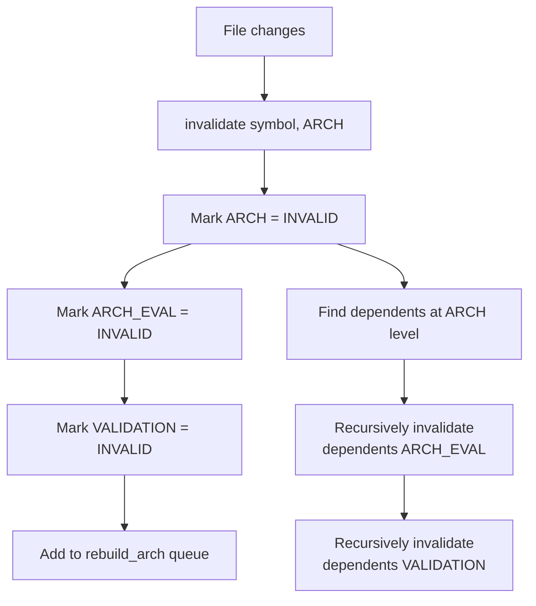

**Example**: File B changes, File A imports B
1. `invalidate(file_b, ARCH)`
2. Mark file_b: ARCH=INVALID, ARCH_EVAL=INVALID, VALIDATION=INVALID
3. Find dependents: file_a depends on file_b at ARCH level
4. Recursively invalidate file_a's ARCH_EVAL and VALIDATION
5. Add file_b to `rebuild_arch` queue

---

## 9. Common Patterns & Idioms

### 1. Rc/Weak Pattern for Preventing Cycles

**Problem**: Parent ↔ Child relationships create reference cycles

**Solution**: Parent holds `Rc`, child holds `Weak`

```rust
// Creating a symbol
let symbol = Rc::new(RefCell::new(Symbol::File(FileSymbol::new(...))));

// Set up self-reference (for creating weak pointers)
symbol.borrow_mut().set_weak_self(Rc::downgrade(&symbol));

// Set parent (weak reference to prevent cycle)
symbol.borrow_mut().set_parent(Some(parent_weak));

// Usage: Upgrade weak reference
if let Some(parent_rc) = symbol.borrow().parent().as_ref()?.upgrade() {
    // Use parent_rc
}
```

### 2. Interior Mutability with RefCell

**Problem**: Need to modify symbol while holding references to it

**Solution**: `Rc<RefCell<Symbol>>` allows borrowing at runtime

```rust
let symbol: Rc<RefCell<Symbol>> = ...;

// Immutable borrow
{
    let borrowed = symbol.borrow();
    println!("Name: {}", borrowed.name());
}  // Drop borrow before mutable borrow

// Mutable borrow
symbol.borrow_mut().set_name(new_name);

// Avoid: Panic if already borrowed
// let borrow1 = symbol.borrow();
// let borrow2 = symbol.borrow_mut();  // PANIC: already borrowed
```

**Debug**: Set `DEBUG_BORROW_GUARDS = true` to track RefCell borrows

### 3. OYarn String Interning

**Purpose**: Reduce memory usage for repeated strings (field names, etc.)

```rust
// Use oyarn! macro (handles both release and debug builds)
use oyarn;
let name: OYarn = oyarn!("field_name");

// Production: byteyarn::Yarn (interned string)
// Debug with debug_yarn feature: String (for easier debugging)

// Never construct OYarn directly, always use the macro
```

### 4. Dependency Tracking (2D Arrays)

**Structure**: `dependencies[step][level]`

```rust
// File A's VALIDATION step needs File B's ARCH_EVAL step
file_a.borrow_mut().add_dependency(
    &mut file_b.borrow_mut(),
    BuildSteps::VALIDATION,  // My step that needs dependency
    BuildSteps::ARCH_EVAL    // Required level from dependency
);

// Storage: dependencies[2][1] contains weak reference to file_b
// dependencies[VALIDATION][ARCH_EVAL] → Set<Weak<Symbol>>
```

### 5. Section-Based Visibility

**Purpose**: Handle control flow where variables may not always be defined

```rust
// Current section
let section = parent.borrow().get_section_for(position);

// Add symbol to section
parent.borrow_mut().add_symbol(&variable, section.index);

// Lookup (considers reachable sections)
let symbols = parent.borrow().get_content_symbol(
    oyarn!("variable_name"),
    position
);

// Create new section (e.g., for if body)
let if_section = parent.borrow_mut().add_section(
    if_start,
    Some(SectionIndex::INDEX(current_section))
);
```

### 6. Build Status Checking

**Pattern**: Always check prerequisites before building

```rust
// Check if previous step is done
if symbol.borrow().build_status(BuildSteps::ARCH) != BuildStatus::DONE {
    return;  // Can't proceed to ARCH_EVAL yet
}

// Shorthand: previous_step_done
if symbol.borrow().previous_step_done(BuildSteps::ARCH_EVAL) {
    // ARCH is DONE, can proceed with ARCH_EVAL
}

// Set status
symbol.borrow_mut().set_build_status(BuildSteps::ARCH, BuildStatus::IN_PROGRESS);
// ... do work ...
symbol.borrow_mut().set_build_status(BuildSteps::ARCH, BuildStatus::DONE);
```

### 7. Cancellation Checking

**Purpose**: Allow interrupting long-running operations

```rust
// In long loops
for symbol in symbols {
    if session.sync_odoo.interrupt_rebuild.load(Ordering::Relaxed) {
        break;  // Stop current rebuild
    }
    if session.sync_odoo.terminate_rebuild.load(Ordering::Relaxed) {
        return;  // Full shutdown
    }
    // ... process symbol ...
}
```

---

## 10. Troubleshooting & Debugging

### Debug Constants (`constants.rs`)

Enable detailed logging by setting these constants:

```rust
pub const DEBUG_STEPS: bool = false;           // Log each build step
pub const DEBUG_STEPS_ONLY_INTERNAL: bool = true;  // Only log non-external files
pub const DEBUG_THREADS: bool = false;         // Thread lifecycle logs
pub const DEBUG_BORROW_GUARDS: bool = false;   // Track RefCell borrows
pub const DEBUG_ODOO_BUILDER: bool = false;    // Odoo-specific building
pub const DEBUG_MEMORY: bool = false;          // Memory usage tracking
```

### Logging

The server uses the `tracing` crate for structured logging.

**Log files**: `server/logs/odoo_ls_<timestamp>.log`

**Macros**:
```rust
use tracing::{trace, debug, info, warn, error};

trace!("Detailed trace: {}", details);
debug!("Debug info: {}", info);
info!("General info: {}", message);
warn!("Warning: {}", issue);
error!("Error: {}", problem);
```

**Log levels**: Set via `Odoo.serverLogLevel` in VS Code settings
- `trace`: Most verbose
- `debug`: Debug information
- `info`: General information (default)
- `warn`: Warnings only
- `error`: Errors only

### Common Issues

#### "Symbol not found" / Autocomplete not working

**Cause**: File not built or dependencies not resolved

**Debug**:
1. Check build status: Is ARCH_EVAL DONE?
2. Check imports: Are imported files successfully resolved?
3. Check entry points: Is file in correct entry point?
4. Enable `DEBUG_STEPS` and rebuild

#### "Already borrowed: BorrowMutError"

**Cause**: Attempting mutable borrow while immutable borrow is active

**Debug**:
1. Enable `DEBUG_BORROW_GUARDS`
2. Check for overlapping borrows
3. Drop borrows explicitly: `drop(borrow)`

**Fix**:
```rust
// Bad: Overlapping borrows
let name = symbol.borrow().name().clone();  // Immutable borrow still active
symbol.borrow_mut().set_name(new_name);     // PANIC

// Good: Drop borrow first
{
    let name = symbol.borrow().name().clone();
}  // Borrow dropped
symbol.borrow_mut().set_name(new_name);  // OK
```

#### "Model fields not recognized"

**Cause**: Model not registered or wrong module dependencies

**Debug**:
1. Check if model exists in `session.sync_odoo.models`
2. Verify module dependencies in `__manifest__.py`
3. Check `ModelData.computes` for field→function mapping
4. Ensure ARCH_EVAL phase completed for model class

#### Rebuild loops / Performance issues

**Cause**: Circular dependencies or unnecessary invalidation

**Debug**:
1. Enable `DEBUG_STEPS` to see rebuild patterns
2. Check dependency graph: `symbol.dependencies()`
3. Look for import cycles
4. Verify invalidation is not too aggressive

### Testing

**Location**: `server/tests/`

**Setup**: Tests require `COMMUNITY_PATH` environment variable
```bash
export COMMUNITY_PATH=/path/to/odoo
cd server
cargo test
```

**Test utilities** (`tests/setup/setup.rs`):
- `setup_server()`: Initialize test server
- `create_init_session()`: Create test session with config

**Example test structure**:
```rust
#[test]
fn test_symbol_lookup() {
    let (server, session_info) = setup_server();
    
    // Build test file
    let file = create_test_file(&mut session_info, "test.py", "x = 5");
    
    // Trigger build
    session_info.sync_odoo.process_rebuilds(&mut session_info);
    
    // Verify symbol exists
    let symbols = session_info.sync_odoo.get_symbol("", &tree, u32::MAX);
    assert!(!symbols.is_empty());
}
```

---

## 11. References

### File Index

**Core Symbol System**:
- `server/src/core/symbols/symbol.rs` - Symbol enum, weak_ptr_eq, construction methods
- `server/src/core/symbols/file_symbol.rs` - FileSymbol struct, dependencies
- `server/src/core/symbols/class_symbol.rs` - ClassSymbol, ModelData
- `server/src/core/symbols/function_symbol.rs` - FunctionSymbol, return types
- `server/src/core/symbols/variable_symbol.rs` - VariableSymbol, type tracking
- `server/src/core/symbols/symbol_mgr.rs` - SymbolMgr trait, section-based visibility
- `server/src/core/symbols/module_symbol.rs` - ModuleSymbol (Odoo modules)

**Build Pipeline**:
- `server/src/core/python_arch_builder.rs` - ARCH phase implementation
- `server/src/core/python_arch_eval.rs` - ARCH_EVAL phase implementation
- `server/src/core/python_validator.rs` - VALIDATION phase implementation
- `server/src/core/python_arch_eval_hooks.rs` - Hook system for Odoo patterns
- `server/src/core/python_odoo_builder.rs` - Odoo-specific processing

**Model & Evaluation**:
- `server/src/core/model.rs` - Model, ModelData structs
- `server/src/core/evaluation.rs` - Type inference (analyze_ast)
- `server/src/core/type_manager.rs` - Type representation

**Infrastructure**:
- `server/src/core/odoo.rs` - SyncOdoo main orchestrator
- `server/src/core/entry_point.rs` - EntryPoint, EntryPointMgr
- `server/src/core/file_mgr.rs` - FileMgr, AST caching
- `server/src/core/import_resolver.rs` - Import resolution
- `server/src/constants.rs` - BuildSteps, BuildStatus, SymType

**Server**:
- `server/src/server.rs` - LSP message routing
- `server/src/main.rs` - Entry point

### Key Structs & Enums

**Symbol Types**:
- `Symbol` - Main symbol enum
- `FileSymbol` - Python file
- `ClassSymbol` - Python class
- `FunctionSymbol` - Function/method
- `VariableSymbol` - Variable/import

**Build System**:
- `BuildSteps` - ARCH, ARCH_EVAL, VALIDATION
- `BuildStatus` - PENDING, IN_PROGRESS, DONE, INVALID
- `PythonArchBuilder` - ARCH phase builder
- `PythonArchEval` - ARCH_EVAL phase evaluator
- `PythonValidator` - VALIDATION phase validator

**Model System**:
- `Model` - Odoo model aggregation
- `ModelData` - Model metadata (_name, _inherit, etc.)

**Evaluation**:
- `Evaluation` - Type inference result
- `EvaluationSymbol` - Reference to type symbol
- `EvaluationValue` - Literal value if constant
- `Context` - Metadata for type inference

**Infrastructure**:
- `SyncOdoo` - Main state manager
- `EntryPoint` - Python execution context
- `EntryPointMgr` - Manages entry points
- `FileMgr` - File content and AST cache
- `FileInfo` - Per-file information

### Related Documentation

- **[Build & Rebuild Lifecycle](./build-rebuild-lifecycle.md)** - Comprehensive deep-dive into the build pipeline, covering server startup, LSP initialization, dependency tracking, partial rebuilds, and the debounce/interrupt mechanisms. Essential reading for understanding how file changes trigger rebuilds.

### Further Reading

- **LSP Specification**: https://microsoft.github.io/language-server-protocol/
- **Ruff Parser**: Used for Python AST parsing (pinned version)
- **Odoo Framework**: https://www.odoo.com/documentation/
- **Rust RefCell**: https://doc.rust-lang.org/std/cell/struct.RefCell.html
- **Weak References**: https://doc.rust-lang.org/std/rc/struct.Weak.html

---

**Next Steps**: Now that you understand the core Python support, explore:
1. How LSP features (completion, hover, etc.) use the symbol tree - see `server/src/features/`
2. XML validation and how it uses the model system - see `server/src/core/xml_validation.rs`
3. Configuration and workspace management - see `server/src/core/config.rs`

**Contributing**: When extending the system:
- Follow the three-phase build pattern
- Use weak references for cycles
- Check `previous_step_done()` before building
- Add tests in `server/tests/`
- Update this documentation!
