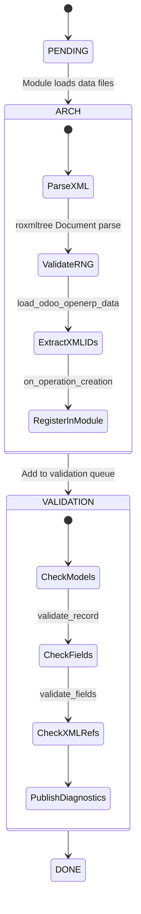
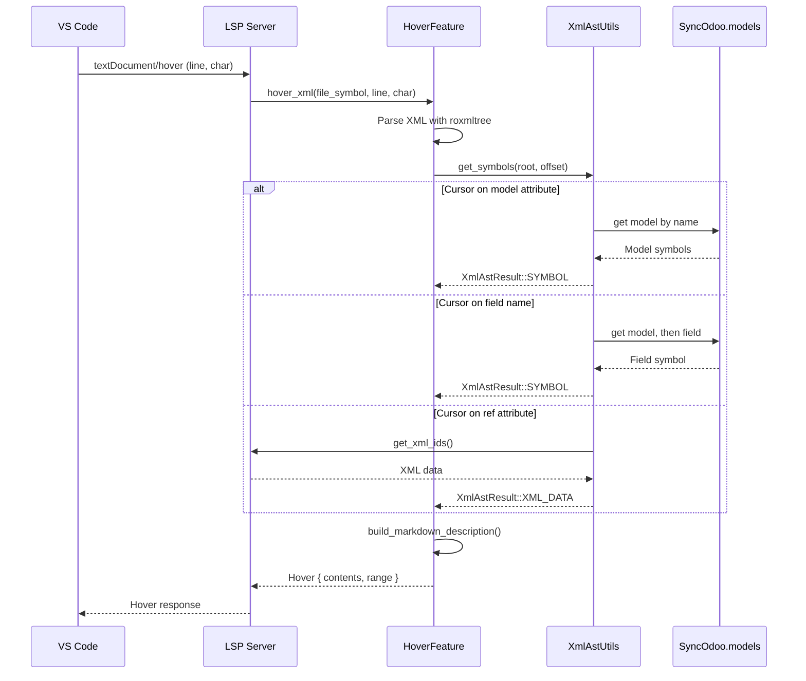
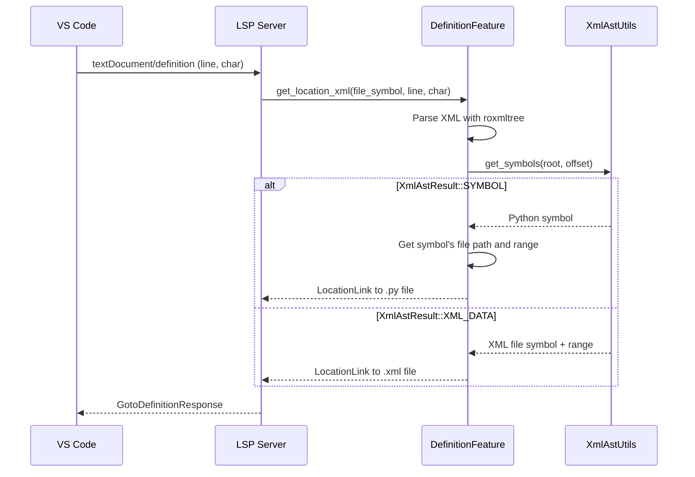
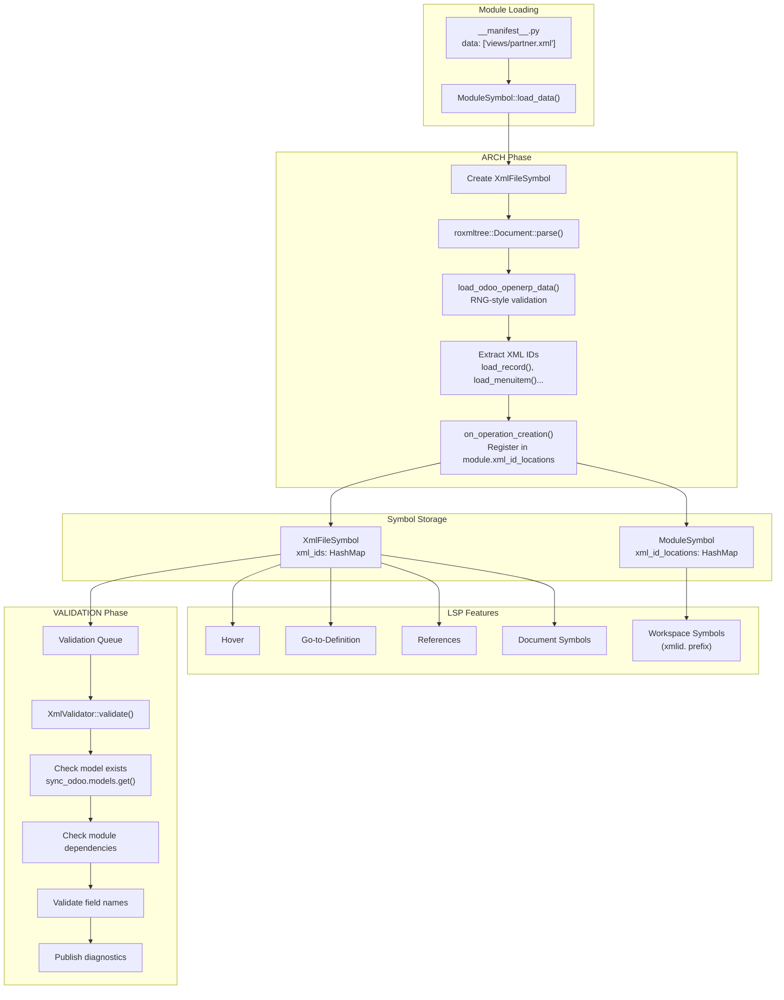

# XML Processing Guide - Odoo Language Server

> **Audience**: Developers who want to understand how the Odoo Language Server processes XML data files.  
> **Scope**: This guide covers XML symbol building, validation, diagnostics, and LSP features for Odoo XML files.  
> **Prerequisites**: Familiarity with the [Python Build Pipeline](python-build-pipeline.md) and basic Rust knowledge.

## Table of Contents

1. [Introduction](#1-introduction)
2. [XML Symbol Types](#2-xml-symbol-types)
3. [Two-Phase Build Pipeline](#3-two-phase-build-pipeline)
4. [RNG-Style Validation](#4-rng-style-validation)
5. [Diagnostic Codes Reference](#5-diagnostic-codes-reference)
6. [LSP Features](#6-lsp-features)
7. [Data Flow](#7-data-flow)
8. [Integration with Python](#8-integration-with-python)

---

## 1. Introduction

The Odoo Language Server processes XML data files found in Odoo modules. These files define records, views, menus, actions, and other data that Odoo loads at runtime. Unlike Python files which go through a three-phase pipeline (ARCH → ARCH_EVAL → VALIDATION), XML files use a **two-phase pipeline**:

1. **ARCH**: Parse XML, validate structure, extract XML IDs
2. **VALIDATION**: Check model/field existence against Python symbols

### Supported XML Elements

| Element | Purpose | Example |
|---------|---------|---------|
| `<record>` | Create/update database records | `<record model="res.partner" id="partner_demo">` |
| `<menuitem>` | Define menu entries | `<menuitem id="menu_sale" action="action_sale"/>` |
| `<template>` | QWeb templates (views) | `<template id="portal_my_home">` |
| `<function>` | Call Python methods | `<function model="res.users" name="create"/>` |
| `<delete>` | Remove records | `<delete model="ir.ui.view" id="old_view"/>` |
| `<report>` | Define reports | `<report id="report_invoice" model="account.move"/>` |

### Design Principles

1. **Odoo-Aware**: Understands Odoo's data file conventions and validates against module dependencies
2. **Lazy Model Resolution**: Model/field validation happens in the VALIDATION phase after Python symbols are built
3. **XML ID Tracking**: All XML IDs are registered in the module symbol for cross-file lookups

---

## 2. XML Symbol Types

### 2.1 XmlFileSymbol

Each XML data file is represented by an `XmlFileSymbol` in the symbol tree:

```
Root
└── EntryPoint (ADDON)
    └── DiskDir
        └── ModuleSymbol (sale)
            └── XmlFileSymbol (views/sale_order_views.xml)
```

**Key Fields** (`core/symbols/xml_file_symbol.rs`):

| Field | Type | Description |
|-------|------|-------------|
| `name` | `OYarn` | File name (e.g., `sale_order_views.xml`) |
| `path` | `String` | Full filesystem path |
| `xml_ids` | `HashMap<OYarn, Vec<OdooData>>` | XML IDs declared in this file |
| `arch_status` | `BuildStatus` | ARCH phase status |
| `validation_status` | `BuildStatus` | VALIDATION phase status |
| `not_found_models` | `HashMap<OYarn, BuildSteps>` | Models referenced but not found |

### 2.2 OdooData Enum

The `OdooData` enum (`core/xml_data.rs`) represents different types of XML records:

```rust
pub enum OdooData {
    RECORD(OdooDataRecord),     // <record model="..." id="...">
    MENUITEM(XmlDataMenuItem),  // <menuitem id="...">
    TEMPLATE(XmlDataTemplate),  // <template id="...">
    DELETE(XmlDataDelete),      // <delete model="..." id="...">
}
```

#### OdooDataRecord

Represents a `<record>` element with its model, XML ID, and field values:

```rust
pub struct OdooDataRecord {
    pub file_symbol: Weak<RefCell<Symbol>>,  // Parent XML file
    pub model: (OYarn, Range<usize>),        // Model name + byte range
    pub xml_id: Option<OYarn>,               // Record's XML ID
    pub fields: Vec<OdooDataField>,          // Field values
    pub range: Range<usize>,                 // Byte range in file
}
```

#### OdooDataField

Represents a `<field>` element within a record:

```rust
pub struct OdooDataField {
    pub name: OYarn,                         // Field name
    pub range: Range<usize>,                 // Byte range
    pub text: Option<String>,                // Text content
    pub ref_key: Option<(String, Range<usize>)>, // ref="..." value
    pub text_range: Option<Range<usize>>,    // Text content range
}
```

#### XmlDataMenuItem, XmlDataTemplate, XmlDataDelete

Simpler structures for menu items, templates, and delete operations:

```rust
pub struct XmlDataMenuItem {
    pub file_symbol: Weak<RefCell<Symbol>>,
    pub xml_id: Option<OYarn>,
    pub range: Range<usize>,
}

pub struct XmlDataTemplate {
    pub file_symbol: Weak<RefCell<Symbol>>,
    pub xml_id: Option<OYarn>,
    pub range: Range<usize>,
}

pub struct XmlDataDelete {
    pub file_symbol: Weak<RefCell<Symbol>>,
    pub xml_id: Option<OYarn>,
    pub range: Range<usize>,
    pub model: OYarn,
}
```

---

## 3. Two-Phase Build Pipeline

XML files are processed in two sequential phases. This is simpler than Python's three-phase pipeline because XML files don't have the complex import/evaluation dependencies that Python has.

<details>
<summary><strong>Pipeline State Diagram</strong></summary>



</details>

### 3.1 Phase 1: ARCH (Architecture)

**Goal**: Parse XML structure, validate element syntax, and extract XML IDs.  
**Builder**: `XmlArchBuilder` (`core/xml_arch_builder.rs`)

#### Entry Point

The ARCH phase is triggered when a module loads its data files from `__manifest__.py`:

```python
# __manifest__.py
{
    'data': [
        'views/sale_order_views.xml',
        'data/demo_data.xml',
    ],
}
```

For each file listed in `data`, the module symbol calls `load_data()`, which creates an `XmlArchBuilder`:

```rust
// In ModuleSymbol::load_data()
let xml_sym = symbol.borrow_mut().add_new_xml_file(session, &file_name, &path);
let mut xml_builder = XmlArchBuilder::new(xml_sym);
xml_builder.load_arch(session, &mut file_info, &root);
```

#### Processing Steps

1. **Parse XML**: Uses `roxmltree` crate to parse the file into a DOM tree
2. **Validate Root**: Check `<odoo>`, `<openerp>`, or `<data>` root element
3. **Process Children**: Recursively validate each element type
4. **Extract XML IDs**: Register each declared ID in the module's `xml_id_locations` map
5. **Queue for Validation**: Add symbol to `session.sync_odoo.validations` queue

#### Key Functions

| Function | File | Purpose |
|----------|------|---------|
| `load_arch()` | `xml_arch_builder.rs` | Main entry point, sets build status |
| `load_odoo_openerp_data()` | `xml_arch_builder_rng_validation.rs` | Validates root element and children |
| `load_record()` | `xml_arch_builder_rng_validation.rs` | Process `<record>` elements |
| `load_field()` | `xml_arch_builder_rng_validation.rs` | Process `<field>` elements |
| `load_menuitem()` | `xml_arch_builder_rng_validation.rs` | Process `<menuitem>` elements |
| `on_operation_creation()` | `xml_arch_builder.rs` | Register XML ID in module |

### 3.2 Phase 2: VALIDATION

**Goal**: Verify that referenced models and fields exist in Python symbols.  
**Validator**: `XmlValidator` (`core/xml_validation.rs`)

#### Entry Point

After ARCH completes, the XML symbol is added to the validation queue. The main rebuild loop processes this queue:

```rust
// In rebuild loop
let mut validator = XmlValidator::new(&entry, symbol.clone());
validator.validate(session);
```

#### Processing Steps

1. **Iterate XML IDs**: For each `OdooData` in the file's `xml_ids`
2. **Check Model Existence**: Verify the model exists in `session.sync_odoo.models`
3. **Check Module Dependencies**: Verify the model is accessible from this module's dependencies
4. **Validate Fields**: For each field in a record, check it exists on the model
5. **Track Dependencies**: Record symbol dependencies for incremental rebuilds
6. **Publish Diagnostics**: Send diagnostics to the client

#### Key Functions

| Function | File | Purpose |
|----------|------|---------|
| `validate()` | `xml_validation.rs` | Main entry point |
| `validate_xml_id()` | `xml_validation.rs` | Dispatch to type-specific validator |
| `validate_record()` | `xml_validation.rs` | Check model exists and is accessible |
| `validate_fields()` | `xml_validation.rs` | Check each field exists on model |

---

## 4. RNG-Style Validation

The ARCH phase includes structural validation of XML elements. This is implemented directly in Rust code (`xml_arch_builder_rng_validation.rs`), not via actual RelaxNG schemas.

### Supported Root Elements

| Element | Valid Attributes | Valid Children |
|---------|------------------|----------------|
| `<odoo>` | `noupdate`, `auto_sequence`, `uid`, `context` | All data elements |
| `<openerp>` | Same as `<odoo>` | Same as `<odoo>` |
| `<data>` | Same as `<odoo>` | Same as `<odoo>` |

### Element Validation Rules

#### `<record>` Element

| Attribute | Required | Description |
|-----------|----------|-------------|
| `model` | **Yes** | Target model name |
| `id` | No | XML ID for the record |
| `forcecreate` | No | Force creation even if exists |
| `uid` | No | User context |
| `context` | No | Evaluation context |

**Children**: Only `<field>` elements allowed.

#### `<field>` Element

| Attribute | Required | Description |
|-----------|----------|-------------|
| `name` | **Yes** | Field name on the model |
| `type` | No* | Value type: `int`, `float`, `list`, `tuple`, `xml`, `html`, `file`, `base64`, `char` |
| `ref` | No* | Reference to another XML ID |
| `eval` | No* | Python expression to evaluate |
| `search` | No* | Domain to search for records |
| `model` | No | Model for `eval`/`search` context |
| `use` | No | Field to use from search result |
| `file` | No | External file path |

*Only one of `type`, `ref`, `eval`, or `search` can be specified.

#### `<menuitem>` Element

| Attribute | Required | Description |
|-----------|----------|-------------|
| `id` | **Yes** | XML ID for the menu |
| `name` | No | Menu label |
| `sequence` | No | Sort order (must be integer) |
| `parent` | No | Parent menu XML ID |
| `action` | No | Action to execute |
| `groups` | No | Security groups (comma-separated) |
| `web_icon` | No | Icon (not allowed with `parent`) |
| `active` | No | Whether menu is active |

**Children**: Only nested `<menuitem>` elements allowed.

#### `<function>` Element

| Attribute | Required | Description |
|-----------|----------|-------------|
| `model` | **Yes** | Model to call method on |
| `name` | **Yes** | Method name |
| `eval` | No* | Arguments as Python expression |
| `uid` | No | User context |
| `context` | No | Evaluation context |

*Cannot have `<value>` or `<function>` children when `eval` is present.

**Children**: `<value>` or `<function>` elements (when no `eval`).

#### `<delete>` Element

| Attribute | Required | Description |
|-----------|----------|-------------|
| `model` | **Yes** | Model to delete from |
| `id` | No* | XML ID to delete |
| `search` | No* | Domain to find records |

*Exactly one of `id` or `search` required.

#### `<value>` Element

| Attribute | Required | Description |
|-----------|----------|-------------|
| `name` | No | Argument name |
| `type` | No* | Value type |
| `eval` | No* | Python expression |
| `search` | No* | Domain search |
| `file` | No* | External file |
| `model` | No | Model context |

*Mutually exclusive attributes.

#### `<template>` Element

Templates are QWeb view definitions. The builder extracts the `id` attribute but doesn't deeply validate template content (QWeb syntax).

#### `<report>` Element

| Attribute | Required | Description |
|-----------|----------|-------------|
| `id` | No | XML ID |
| `model` | **Yes** | Model the report applies to |
| `name` | **Yes** | Report technical name |
| `string` | **Yes** | Report display name |
| `report_type` | No | Type (qweb-pdf, qweb-html) |
| `binding_model` | No | Model to bind action to |
| `binding_type` | No | Binding type |
| `binding_views` | No | View types (comma-separated) |

---

## 5. Diagnostic Codes Reference

All XML diagnostic codes are in the `OLS05XXX` range. They are grouped below by the element type they relate to.

### 5.1 Parsing Errors

| Code | Severity | Message | Trigger |
|------|----------|---------|---------|
| **OLS05000** | Error | `Unable to parse XML file: {0}` | XML syntax error (malformed XML) |

### 5.2 Root/Data Element Errors

| Code | Severity | Message | Trigger |
|------|----------|---------|---------|
| **OLS05004** | Error | `Invalid attribute` | Unknown attribute on `<odoo>`, `<openerp>`, or `<data>` |
| **OLS05005** | Error | `Invalid node tag` | Unknown child element in data root |

### 5.3 XML ID Errors

| Code | Severity | Message | Trigger |
|------|----------|---------|---------|
| **OLS05001** | Error | `Unknown XML ID` | Referenced XML ID not found in any loaded module |
| **OLS05002** | Error | `Unspecified module. Add the module name before the XML ID: 'module.xml_id'` | XML ID reference missing module prefix |
| **OLS05003** | Error | `Unknown module` | Module prefix in XML ID doesn't exist |
| **OLS05039** | Error | `Empty XML ID. Please provide a valid XML ID.` | Empty `ref=""` attribute |
| **OLS05051** | Error | `Invalid XML ID '{0}'. It should not contain more than one dot.` | XML ID has multiple dots (e.g., `a.b.c`) |

### 5.4 `<menuitem>` Errors

| Code | Severity | Message | Trigger |
|------|----------|---------|---------|
| **OLS05006** | Error | `menuitem node must contains an id attribute` | Missing `id` attribute |
| **OLS05007** | Error | `Invalid attribute {0} in menuitem node` | Unknown attribute |
| **OLS05008** | Error | `Sequence attribute must be a string representing an integer` | Non-integer `sequence` value |
| **OLS05009** | Error | `SubmenuItem is not allowed when action and parent attributes are defined on a menuitem` | Nested menuitem with conflicting attributes |
| **OLS05010** | Error | `web_icon attribute is not allowed when parent is specified` | `web_icon` used with `parent` |
| **OLS05011** | Error | `Invalid child node {0} in menuitem` | Non-menuitem child element |
| **OLS05012** | Error | `parent attribute is not allowed in submenuitems` | `parent` attribute on nested menuitem |
| **OLS05052** | Error | `Parent menuitem with id '{0}' does not exist` | Parent XML ID not found |
| **OLS05053** | Error | `Action with id '{0}' does not exist` | Action XML ID not found |
| **OLS05054** | Error | `Group(s) with id(s) '{0}' does not exist` | Group XML ID(s) not found |

### 5.5 `<record>` Errors

| Code | Severity | Message | Trigger |
|------|----------|---------|---------|
| **OLS05013** | Error | `Invalid attribute {0} in record node` | Unknown attribute |
| **OLS05014** | Error | `record node must contain a model attribute` | Missing `model` attribute |
| **OLS05015** | Error | `Invalid child node {0} in record. Only field node is allowed` | Non-field child element |

### 5.6 `<field>` Errors

| Code | Severity | Message | Trigger |
|------|----------|---------|---------|
| **OLS05016** | Error | `field node must contain a name attribute` | Missing `name` attribute |
| **OLS05017** | Error | `field node cannot have more than one of the attributes type, ref, eval or search` | Multiple exclusive attributes |
| **OLS05018** | Error | `Invalid content for int field: {0}` | Non-integer value in `type="int"` field |
| **OLS05019** | Error | `Invalid content for float field: {0}` | Non-float value in `type="float"` field |
| **OLS05020** | Error | `Invalid child node {0} in list/tuple field` | Invalid child in `type="list"` or `type="tuple"` |
| **OLS05021** | Error | `text content is not allowed on a value that contains a file attribute` | Text content with `file` attribute |
| **OLS05022** | Error | `text content is not allowed on a field with {0} attribute` | Text content with `ref`/`eval`/`search` |
| **OLS05023** | Error | `model attribute is not allowed on field node without eval or search attribute` | `model` without `eval`/`search` |
| **OLS05024** | Error | `use attribute is only allowed on field node with search attribute` | `use` without `search` |
| **OLS05025** | Error | `Invalid attribute {0} in field node` | Unknown attribute |
| **OLS05026** | Error | `Fields only allow 'record' children nodes` | Invalid child element |

### 5.7 `<value>` Errors

| Code | Severity | Message | Trigger |
|------|----------|---------|---------|
| **OLS05027** | Error | `search attribute is not allowed when eval, type, file, or text content is present` | `search` with conflicting attributes |
| **OLS05028** | Error | `eval attribute is not allowed when search, type, file, or text content is present` | `eval` with conflicting attributes |
| **OLS05029** | Error | `type attribute is not allowed when search or eval attribute is present` | `type` with `search`/`eval` |
| **OLS05030** | Error | `text content is not allowed on a value that contains a file attribute` | Text with `file` attribute |
| **OLS05031** | Error | `file attribute is not allowed when search or eval attribute is present` | `file` with `search`/`eval` |
| **OLS05032** | Error | `Invalid attribute {0} in value node` | Unknown attribute |
| **OLS05036** | Error | `Empty Value data, text data or file attribute has to be provided when 'type' attribute is present` | Empty typed value |
| **OLS05037** | Error | `Empty Value data, one of text data, 'file', 'eval', or 'search' has to be provided` | Empty value element |

### 5.8 `<delete>` Errors

| Code | Severity | Message | Trigger |
|------|----------|---------|---------|
| **OLS05033** | Error | `delete node must contain a model attribute` | Missing `model` attribute |
| **OLS05034** | Error | `delete node cannot have both id and search attributes` | Both `id` and `search` present |
| **OLS05035** | Error | `delete node must have either id or search attribute` | Neither `id` nor `search` present |

### 5.9 `<function>` Errors

| Code | Severity | Message | Trigger |
|------|----------|---------|---------|
| **OLS05038** | Error | `Empty Function data, either of 'eval' attribute, or one or more 'value', or 'function' children have to be provided` | Empty function element |
| **OLS05044** | Error | `function node must contain a {0} attribute` | Missing `model` or `name` attribute |
| **OLS05045** | Error | `function node cannot have value children when eval attribute is present` | `<value>` children with `eval` |
| **OLS05046** | Error | `Invalid attribute {0} in function node` | Unknown attribute |
| **OLS05047** | Error | `function node cannot have function children when eval attribute is present` | `<function>` children with `eval` |
| **OLS05048** | Error | `Invalid child node {0} in function node` | Invalid child element |

### 5.10 `<report>` Errors

| Code | Severity | Message | Trigger |
|------|----------|---------|---------|
| **OLS05040** | Error | `binding_views attribute must be a comma-separated list of view types matching ^([a-z]+(,[a-z]+)*)?$, found {0}` | Invalid `binding_views` format |
| **OLS05041** | Error | `report node must contain a {0} attribute` | Missing required attribute |
| **OLS05042** | Error | `Invalid attribute {0} in report node` | Unknown attribute |
| **OLS05043** | Error | `report node cannot have text content` | Text content in report |

### 5.11 Data File Errors

| Code | Severity | Message | Trigger |
|------|----------|---------|---------|
| **OLS05049** | Error | `Data file {0} not found in the module` | File in manifest `data` list not found |
| **OLS05050** | Error | `Data file {0} is not a valid XML or CSV file` | Non-XML/CSV file in `data` list |

### 5.12 Model/Field Validation Errors

| Code | Severity | Message | Trigger |
|------|----------|---------|---------|
| **OLS05055** | Error | `Model '{0}' not found in module '{1}' or its dependencies` | Model exists but not accessible from this module |
| **OLS05056** | Error | `Model '{0}' not found` | Model doesn't exist anywhere |
| **OLS05057** | Error | `Field '{0}' not found in model '{1}'` | Field doesn't exist on the model |

---

## 6. LSP Features

### 6.1 Feature Support Matrix

| Feature | XML Support | Implementation |
|---------|-------------|----------------|
| Hover | ✅ | Model/field type info |
| Go-to-Definition | ✅ | Navigate to model/field/XML ID |
| References | ✅ | Find all references to XML ID |
| Document Symbols | ✅ | Outline of XML elements |
| Workspace Symbols | ✅ | Search XML IDs with `xmlid.` prefix |
| Completion | ❌ | Not implemented |

### 6.2 XML AST Utilities

The `XmlAstUtils` struct (`features/xml_ast_utils.rs`) provides symbol resolution for XML files.

#### XmlAstResult Enum

```rust
pub enum XmlAstResult {
    SYMBOL(Rc<RefCell<Symbol>>),              // Python symbol (model, field)
    XML_DATA(Rc<RefCell<Symbol>>, Range<usize>), // XML record reference
}
```

#### get_symbols Function

The main entry point for finding symbols at a cursor position:

```rust
pub fn get_symbols(
    session: &mut SessionInfo,
    file_symbol: &Rc<RefCell<Symbol>>,
    root: roxmltree::Node,
    offset: usize,
    on_dep_only: bool
) -> (Vec<XmlAstResult>, Option<Range<usize>>)
```

**Resolution by Element/Attribute**:

| Element | Attribute | Resolution |
|---------|-----------|------------|
| `<record>` | `model` | Model class symbol(s) |
| `<record>` | `id` | XML data record |
| `<field>` | `name` | Field symbol on current model |
| `<field>` | `ref` | Referenced XML data |
| `<menuitem>` | `action` | Action XML data |
| `<menuitem>` | `groups` | Group XML data |
| `<template>` | `inherit_id` | Parent template XML data |
| `<template>` | `groups` | Group XML data |
| Text content | `model`/`res_model` field | Model class symbol |

### 6.3 Hover

**File**: `features/hover.rs` → `hover_xml()`

<details>
<summary><strong>Hover Sequence Diagram</strong></summary>



</details>

**Behavior**:
- Parses the XML document at the cursor position
- Resolves model names to Python class symbols
- Resolves field names to Python field symbols
- Displays type information and docstrings in hover popup

### 6.4 Go-to-Definition

**File**: `features/definition.rs` → `get_location_xml()`

<details>
<summary><strong>Definition Sequence Diagram</strong></summary>



</details>

**Behavior**:
- For model names → navigates to Python model class definition
- For field names → navigates to Python field definition
- For XML ID references → navigates to the XML record declaration

### 6.5 References

**File**: `features/references.rs` → `get_references_xml()`

**Behavior**:
- Finds all locations where a symbol is referenced
- For Python symbols: returns the Python definition location
- For XML data: returns the XML file and range where it's declared

### 6.6 Document Symbols

**File**: `features/document_symbols.rs` → `visit_xml_document()`

Provides an outline view of the XML document with hierarchical structure:

| Element | SymbolKind | Name Format |
|---------|------------|-------------|
| `<record>` | CLASS | `[record] {id}` |
| `<menuitem>` | CLASS | `[menuitem] {id}` |
| `<template>` | INTERFACE | `[template] {id}` |
| `<field>` | FIELD | `[field] {name}` |
| `<function>` | FUNCTION | `[function] {name}` |
| `<delete>` | CONSTRUCTOR | `[delete] {model}` |
| `<report>` | PACKAGE | `[report] {name}` |
| `<value>` | TYPE_PARAMETER | `[value] {name}` |
| `<act_window>` | METHOD | `[act_window] {id}` |

### 6.7 Workspace Symbols

**File**: `features/workspace_symbols.rs`

Search for XML IDs across the workspace using the `xmlid.` prefix:

```
xmlid.sale_order_form  →  finds XML ID "sale_order_form"
xmlid.view_partner     →  finds all XML IDs containing "view_partner"
```

The search iterates through all module symbols and their `xml_id_locations` maps, using fuzzy matching.

---

## 7. Data Flow

<details>
<summary><strong>Complete Data Flow Diagram</strong></summary>



</details>

### Key Data Stores

| Store | Location | Purpose |
|-------|----------|---------|
| `XmlFileSymbol.xml_ids` | Per-file | Maps XML ID → `OdooData` records |
| `ModuleSymbol.xml_id_locations` | Per-module | Maps XML ID → set of files declaring it |
| `SyncOdoo.models` | Global | Maps model name → `Model` struct |

### XML ID Registration Flow

1. `XmlArchBuilder::on_operation_creation()` is called for each XML element with an ID
2. The XML ID is split to check for module prefix (`sale.order_form` → `sale`, `order_form`)
3. If a module prefix exists, the ID is registered in that module's `xml_id_locations`
4. Otherwise, it's registered in the current module
5. The `OdooData` is stored in `XmlFileSymbol.xml_ids`

---

## 8. Integration with Python

### 8.1 Model Symbol Dependency

XML validation depends on Python model symbols being built first:

```
Python ARCH_EVAL → Models registered in sync_odoo.models
                          ↓
XML VALIDATION → Checks models exist and fields are valid
```

The `XmlValidator` records dependencies:
- **Symbol dependencies**: XML file depends on Python file defining the model
- **Model dependencies**: XML file depends on the `Model` struct

### 8.2 Missing Model Handling

If a model isn't found during validation:

1. The model name is added to `XmlFileSymbol.not_found_models`
2. The file is registered in `entry.not_found_symbols_for_models`
3. When the model is later built, files in this set are re-validated

### 8.3 XML ID Resolution from Python

Python code can reference XML IDs:

```python
self.env.ref('sale.order_form')  # → navigates to XML record
```

The `DefinitionFeature::check_for_xml_id_string()` function handles this:

1. Detects string literals that look like XML IDs (contain a dot)
2. Looks up the ID in the referenced module's `xml_id_locations`
3. Returns a `LocationLink` to the XML file and range

### 8.4 Model Field Access

When validating `<field name="partner_id">`:

1. Get the `record_model` from the enclosing `<record model="...">` 
2. Look up the model in `sync_odoo.models`
3. Call `Model::get_main_symbols()` to get class symbols
4. Use `Symbol::all_fields()` to get all fields including inherited ones
5. Check if `partner_id` exists in the field map

---

## See Also

- [Python Build Pipeline](python-build-pipeline.md) - Three-phase Python processing
- [LSP Features Guide](lsp-features.md) - Detailed feature implementations
- [Python Core Onboarding](python-core-onboarding.md) - Symbol tree and ownership patterns
